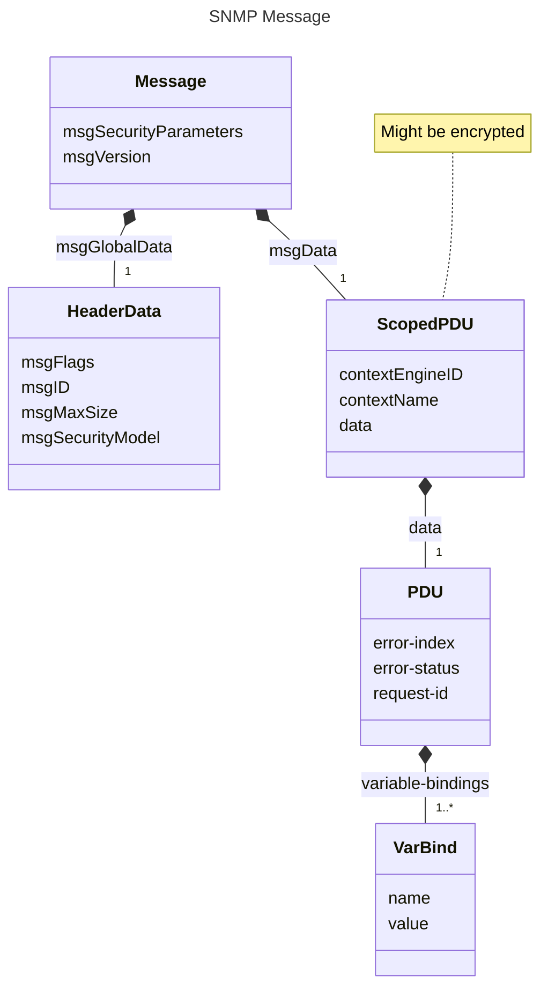
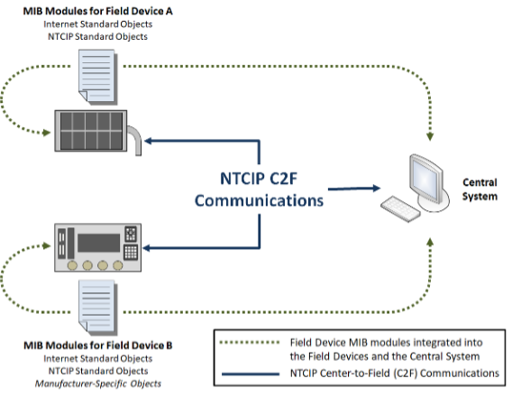

<!-- markdownlint-enable require-heading-body -->

# Background \[Informative\] {.body}

## Introduction {.body}

Within NTCIP, transportation equipment is managed primarily using the
Simple Network Management Protocol (SNMP) to exchange transportation
management information with transportation management applications
(e.g., within a central system). This type of exchange is commonly
called Center-to-Field (C2F) communications. Within SNMP terminology,
the transportation equipment includes an SNMP agent that responds to
requests received from a transportation management application, which is
known as an SNMP management application (or manager). SNMP requests and
responses share a similar structure, which can be depicted in the
Unified Modeling Language (UML), as shown in Figure 1 (with slight
simplifications for the purpose of this discussion).

Starting in the upper-left corner of Figure 1, a message is the logical
SNMP structure that is serialized as a data packet (i.e., byte-stream)
and exchanged by lower-layer protocol entities (e.g., TCP/IP). It
consists of a variety of information, such as protocol header, version
information, security parameters, and a potentially encrypted scoped
protocol data unit (PDU). The scoped PDU includes the context for the
message, error information, the request identifier, and a series of
variable bindings represented as a name/value ordered pair. Within this
structure, each variable binding (i.e., name/value ordered pair) is the
serialized representation of an object instance stored within the
identified SNMP context. An object instance is an instance of a defined
object type, which is a formal abstract definition of a piece of data.

For example (in reverse order), NTCIP 1204, which defines data for
environmental sensor stations, defines an object type called
essAirTemperature. An environmental sensor station might support
multiple temperature sensors; each sensor would be associated with its
own instance of the object type, identified as
`essAirTemperature.<sensor number>`. An SNMP agent could report the
value of any object instance by creating an ordered pair of the name and
value of the object instance and enclosing it in an SNMP message,
potentially with other variable bindings.

In order for the SNMP manager to understand the data contained within
each message, the SNMP manager and SNMP agent must agree on:

1. a mechanism to unambiguously identify the object type and object instance,
2. the precise semantics (i.e., meaning) of the data value,
3. the way in which the data will be encoded,
4. the operations that are allowed (e.g., can a manager alter the value or is it read-only), and
5. the data that should be supported.

These details are specified using a formalized NVT-ASCII text file known
as a Management Information Base (MIB) module coupled with the
definition of SNMP, as defined in RFCs 2578-2580 and RFCs 3411- 3418.

## Management Information Base (MIB) and Module {.body}

A Management Information Base (MIB) is the information that a specific
SNMP context (typically a device) can make available for management
operations. A MIB is defined by a text-based "MIB Module" (or collection
of MIB Modules) that specifies the collection of object types that that
the device supports. A MIB module is written using formal conventions in
a structure that can read by both humans and computers. Object types
include controls, configuration parameters, and status information
(including sensor values and internal device status). Any data that is
to be accessible via SNMP must be defined in a MIB module.

The standardized format of a MIB module allows automating much of the
syntactic processing of data with off-the-shelf SNMP tools and allows
developers to focus on implementing the semantics according to the
documented definitions contained with the MIB module. The rules for the
structure and management of this information also allow multiple MIB
modules (e.g., NTCIP standard, Internet standard, manufacturer-specific
extensions) to be used for a single device. The MIB modules are
integrated into the device software and its management stations using
various methods (e.g, implemented directly as data structures in the
software, compiled into binary tables that facilitate use by operational
software). It is common for the MIB modules to be called the MIB but,
technically, this is incorrect. The MIB is the instantiated collection of
data objects available to management stations to configure, control, and
monitor the device. It is not a database in the traditional sense.

Figure 2 illustrates how using MIB modules makes NTCIP C2F
communications possible. In this example, the field devices are shown on
the left of the figure with their associated MIB modules. The dynamic
message sign uses only objects defined in standards while the traffic
signal controller includes manufacturer-specific objects. The management
station is commonly called a "central system" in transportation systems.

**Figure 2: Integrated MIB Modules Make NTCIP C2F Communications Possible**

## Types of Object Types {.body}

Within SNMP, each piece of management information that can be exchanged
is called an object instance. Object instances are abstracted into
object types and formally defined within the MIB module. However, when
reading a MIB module, it is important to understand the different types
of object types that might occur.

### Leaf Object Types {.body}

Leaf object types do not have any globally unique sub-identifiers
specified and are the only object types that can be instantiated in a
device and retrieved via SNMP operations. The sub-identifiers for leaf
object types are reserved for the identification of specific instances
of the object type; they are only unique within the indicated device
context (e.g., the object type sysName is a leaf object type and has a
globally unique identifier; however, every SNMP device that instantiates
this object type will use the same instance identifier). Leaf objects
can be further classified in three different ways:

1. Based on whether multiple instances are allowed,
2. Based on the complexity of the underlying data, and
3. Based on the types of operations that are permitted.

#### Classification by Instantiation Rules {.body}

If a leaf object type is defined as a part of a conceptual row of a
table, multiple instances of the object are allowed, one for each row
that has been conceptually instantiated within the table. This type of
leaf object type is known as a "columnar object type". The different
instances of the columnar object type are defined according to the
mechanism defined by the INDEX clause of the conceptual row using one or
more sub-identifiers.

If a leaf object type is not defined as a part of a conceptual table,
only one instance of the object can exist; this object type is called a
"scalar object type". The singular instance of a scalar object type is
always identified by the single sub-identifier instance number of "0".

#### Complexity of Object Types {.body}

SNMP was designed to exchange elemental data; as such, leaf object types
are not allowed to directly use any ASN.1 data structure (e.g.,
`SEQUENCE`, `SEQUENCE OF`, `CHOICE`) for its syntax. This allows SNMP to
provide very flexible data exchanges based on the need of the user.
However, within a message, each elemental object instance must be
uniquely identified, which adds overhead.

Within NTCIP, there are often needs to frequently exchange the same set
of object instances in environments where the amount of data that is
exchanged is a concern (e.g., communication environments with data usage
limitations). These environments result in a need for a more efficient
solution than always exchanging data in its most elemental form. To
overcome these issues, the NTCIP classifies every leaf object type as a
simple, block, or configurable object type.

Simple object types represent elemental data, as traditionally defined
with normal SNMP operations. Simple object types include integers, octet
strings, object identifiers, bit strings, and other types that derive
from these basic types.

Block object types represent data structures (e.g., `SEQUENCE`, `SEQUENCE OF`, `CHOICE`) that are normally prohibited as SNMP object types. NTCIP
gets around the SNMP prohibition by setting the `SYNTAX` clause of the
`OBJECT-TYPE` macro to resolve to an `OCTET STRING` (typically by using a
textual convention). It then defines the value of that `OCTET STRING` to
be a serialization of a defined data structure. From the SNMP
perspective, the data is an elemental `OCTET STRING`, but the sender and
receiver perform additional encoding and decoding to allow for the
exchange of a more complex structure. Within NTCIP, the preferred way to
define the serialization of these data structures is by using an
`ITSOerString`, which is defined by ISO 20684-1 as a data structure
specified using X.680 ASN.1 and serialized using the Octet Encoding
Rules (OER).

Configurable object types are similar to block objects in that each
configurable object represents a data structure that can be serialized
into an OCTET STRING and then be exchanged as a single SNMP object type.
However, block object types have static definitions of their data
structures defined within the MIB module. By comparison, configurable
object types allow for a manager to configure the definition of the data
structure after the implementation has been deployed and while the SNMP
agent is running. Within NTCIP, configurable object types are typically
`SEQUENCE` structures and the configuration is typically defined in a
table where each ordered row of the table represents an ordered
`ComponentType` (i.e., field) within the `SEQUENCE` structure. The
serialization of the configurable object typically uses OER to produce
an `OCTET STRING` that can be exchanged by SNMP.

#### Object Type Permissions {.body}

SNMP object types can also be classified based on the types of data
represented and the operations that are allowed under different
scenarios. There are four basic types of object types from this
perspective, as follows:

1. Status object types. Read-only objects that report the conditions
    that can be monitored by the SNMP agent.
2. Control object types. Writeable object types used to request
    real-time activation of a feature of a device. In some cases,
    control objects can also be used to report status.
3. Parameter object types. Writeable object types used to configure the
    SNMP agent where the parameter can be set and validated using a
    single SNMP set operation.
4. Interrelated parameter object types. Writeable object types used to
    configure the SNMP agent where the parameter has sufficient
    interrelationships with other object types to typically require
    multiple SNMP set operations using multiple `SetRequest` messages or a
    complex validation check that might consume more time than is
    reasonable for a traditional SNMP response.

When a device includes interrelated parameter object types, it defines a
mechanism by which the object types can be safely configured. One such
approach is to use the database transaction mode as specified in NTCIP
1201.

### Conceptual Objects {.body}

In addition to the leaf object types described above, MIB modules can
define three types of conceptual object types: conceptual tables,
conceptual rows, conceptual leafs. Conceptual objects can theoretically
be instantiated but because they have a `MAX-ACCESS` value of
`not-accessible`, the rules of SNMP do not allow their exchange and
they do not really exist as protocol entities. An implementation can
only exchange instances of the accessible object types.

A conceptual table defines a set of object types that might
traditionally be represented in a written document using a table format.
Logically, each conceptual table consists of a number of columns and
rows, where each column describes a particular type of data and each row
represents a unique instance of data for each column. A conceptual table
describes the information contained in the table and the rows that the
table should have. It has a `SYNTAX` of `SEQUENCE OF <EntryType>`, where
`<EntryType>` is the name of the conceptual row's data structure.

A conceptual row defines a set of object types that represent a logical
unit of inter-related management information. The row typically supports
multiple columns and the object types referenced by that row logically
has one instance for each defined row. The row object type defines the
rules for the number of rows and the rules for creation and deletion of
rows.

A conceptual leaf is a simple object type that has been identified as
`not-accessible`; for example an index to a table. While SMIv1 allowed
for index object types to be accessible, it provides no real value and
increases the time it takes to walk through the data (i.e., by using
GetNextRequests) supported by the SNMP agent. As a result, SMIv2
prohibits index object types from being accessible, unless they have
been imported from an SMIv1 module. Conceptual leafs can also be defined
when a standard wants to declare data that should be supported by a
device even if it is never exchanged. For example, the trigger function
is required to monitor data within the device and needs to be able to
demonstrate that it has appropriate security credentials to access the
data. The security credential information is stored in non-accessible
objects to indicate that the controller needs to maintain this
information but that the information should never be exchanged.

## Document Overview {.body}

The remaining sections of this document define:

1. The mechanism used to allow multiple independent entities to define
    object types while maintaining globally unique names
2. Requirements for the development of MIB modules
3. Requirements for agent implementations
4. Considerations for operating agencies

In addition, Annex A provides the formal definition of the NTCIP 8004
MIB, which must be imported by all other NTCIP MIBs and Annex B provides
the rules for converting NTCIP MIBs that are based on SMIv1 into the
SMIv2 format required by this document.

