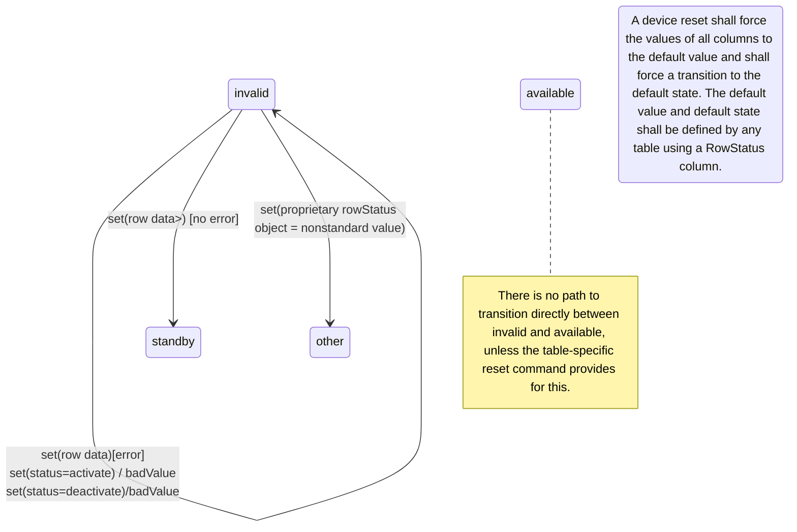
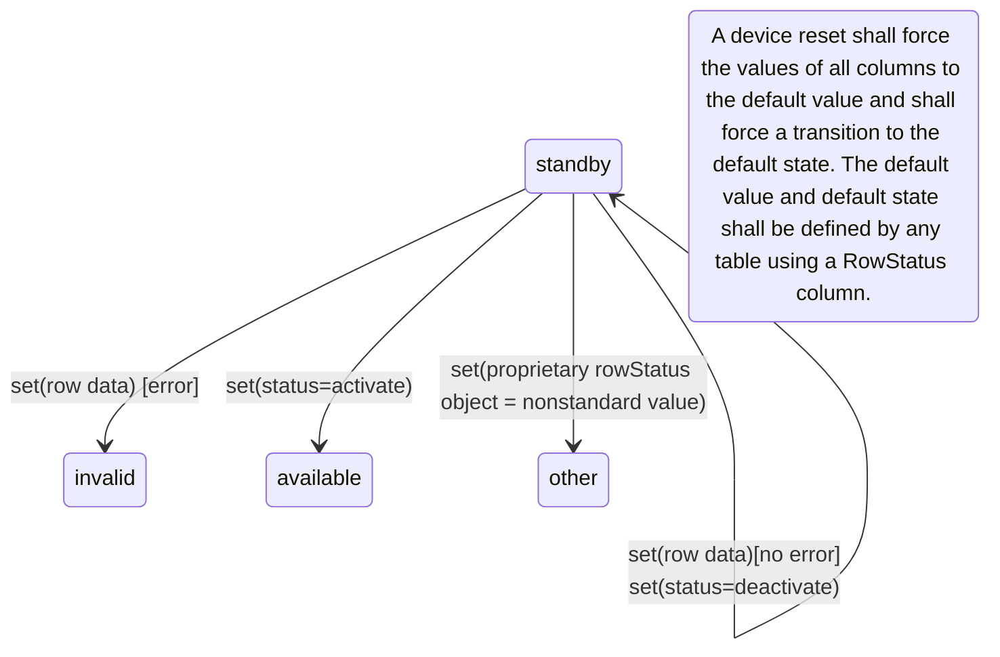
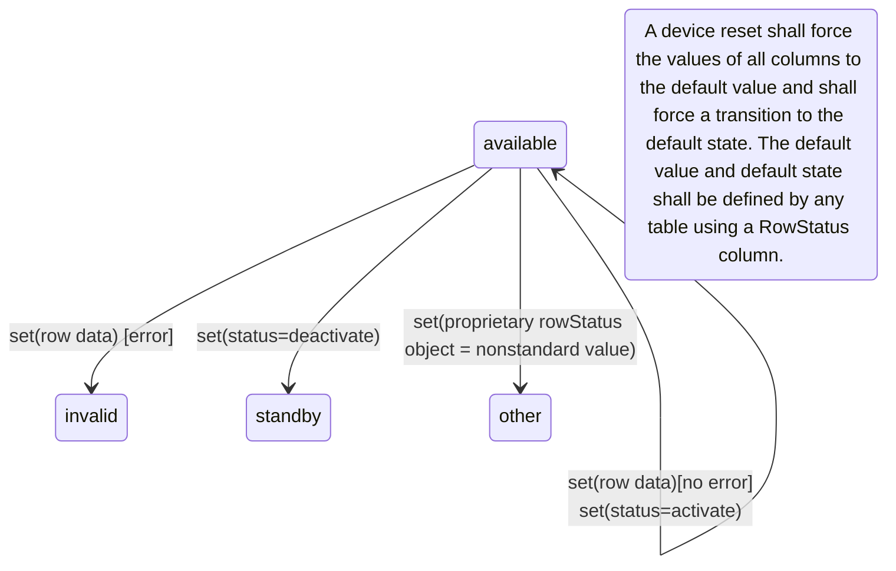

<!-- markdownlint-enable require-heading-body -->

# Rules for Module Development \[Normative\]

Except as otherwise stated within this section and in Annex B, all NTCIP
MIB modules shall conform to:

1. IAB STD 58, which includes:
    1. RFC 2578,
    2. RFC 2579, and
    3. RFC 2580.
2. RFC 3584
3. RFC 4181
4. The additional constraints and conventions defined in this section

Annex B defines allowed exceptions that only apply when converting NTCIP
MIB modules from the IAB STD 16 (SMIv1) format to the IAB STD 58 (SMIv2)
format.

NOTE -- SMIv2 is the second version of the SMI but is used as the MIB
module format for SNMPv3.

## General

The original text of the RFCs is indispensable for a full understanding
of the MIB module format; however, RFCs are typically written in a
conversational/explanatory tone which can result in redundancies and
ambiguities as to the conformance status of each requirement. Further,
some requirements in the referenced RFCs are written to only be
applicable to IETF standard MIB modules while others are for
non-standard MIB modules and tend to be from a technical perspective of
what is allowed as opposed to what should be done. The conformance
requirements adopted by NTCIP are intended to establish a policy for
writing NTCIP standard MIB modules and as a result reflect a slightly
different mix of conformance statuses from what the IETF has defined.
Finally, the requirements for developing a MIB module are scattered over
multiple RFCs, which describe not only the rules for writing the MIB
modules but also on implications to implementations.

The tables presented in this section clarify and highlight the
conformance status of certain requirements and is limited to those rules
related to writing standard NTCIP MIB modules. Rules that are specified
within X.208 and within the information modules defined within the
referenced RFCs are omitted as they are unambiguous, and no changes are
made. This document focuses on the requirements that are only defined
within the text (non-module) sections of the RFCs.

This document groups requirements by topic, regardless of the source of
the requirement. Each requirement is listed in a tabular format with an
item number that allows for easy referencing. The tabular format
consists of the following columns:

- Item: provides a unique identifier for the requirement.

- Requirement: A requirement stated as a \"shall\" statement. This
  almost always requires a rewording of the statement compared with
  original RFC text.

- RFC: When the requirement represents an additional constraint or
  convention of this document, this column is blank; otherwise, it
  identifies the RFC number from which the requirement originates.

- Clause: When the requirement represents an additional constraint or
  convention of this document, this column is blank; otherwise, it
  identifies the location of the requirement within the referenced RFC
  in the following format:

> `<clause>"p"<paragraph>`
>
> where,

- `<clause>` indicates the clause number of the RFC where the
  requirement appears[^6]

- `<paragraph>` indicates an ordered integral position of the paragraph
  within the indicated clause where the requirement appears (numbered
  and bulleted items are considered to be a part of the prior paragraph)

- RFC status: An indication of the conformance status of the requirement
  as interpreted from the RFC for RFC standard MIB modules.

- NTCIP status: An indication of the conformance status of the
  requirement for NTCIP standard MIB modules.

The codes used within the status columns are defined as follows:

**Table 1: Status Codes**

  |Code |Meaning|
  |--------------|--------------------------------------------------------|
  |m    |Mandatory|
  |r    |Recommended|
  |o    |Optional|
  |o.#  |An option group where at least one of the items with the same number (#) must be supported|
  |d    |Discouraged|
  |x    |Prohibited|
  |c    |Conditional|
  
Status codes may be supplemented with footnotes that provide further
details.

Any violations of the requirements contained within this document shall
not negate the intent of any statement contained in a document or MIB
module based on this document.

Non-standard (e.g., manufacturer-specific) MIB modules are outside the
scope of this document.

## Rules for Modules

### General Rules for Modules

Requirements for the construction of X.208 modules within NTCIP
standards are shown in Table 6. Most X.208 modules defined within NTCIP
standards are MIB modules (i.e., they use the OBJECT-TYPE and/or the
NOTIFICATION-TYPE macros). NTCIP standards also include a small number
of other module types, such as the NTCIP8004-NEMA module, contained in
Annex A of this document, which does not include any OBJECT-TYPE or
NOTIFICATION-TYPE macros. The requirements presented in Table 2 apply to
all X.208 modules contained in NTCIP standards.

**Table 2: General Rules for Modules**

| Item    | Requirement                                                                                                                                                                                                                                                                                    | RFC  | Clause | RFC Status | NTCIP Status |
|---------|------------------------------------------------------------------------------------------------------------------------------------------------------------------------------------------------------------------------------------------------------------------------------------------------|------|--------|------------|--------------|
| 4.2.1.a | X.208 modules shall conform to the adapted subset of X.208 ASN.1 as specified in IAB STD 58                                                                                                                                                                                                    | 2578 | 1p1    | m          | m            |
| 4.2.1.b | Each modulereferernce (i.e., module name) shall be unique across all standard modules                                                                                                                                                                                                          | 2578 | 3p6    | m          | m            |
| 4.2.1.c | Each NTCIP module shall have a modulereference (i.e., name) that follows the form:  NTCIP\<StandardNumber\>-\<NodeName\> where, \<StandardNumber\> is the four-digit standard number \<NodeName\> is the name of the MODULE-IDENTITY descriptor in UpperCamelCase Example: NTCIP1201-RecMechV2 |      |        |            | r            |
| 4.2.1.d | Each revision[^7] of a module (e.g., as contained in a new version of a standard) shall use the same modulereference (i.e., module name)                                                                                                                                                       | 2578 | 3p6    | r          | m[^7]           |
| 4.2.1.e | Modules shall use an empty AssignedIdentifier (i.e., there shall not be an OID between the module name and the “DEFINITIONS” keyword)                                                                                                                                                          | 2578 | 3p6    | m          | m            |
| 4.2.1.f | Modules shall not IMPORT any “UNIVERSAL” types defined by ASN.1                                                                                                                                                                                                                                | 2578 | 3.2p4  | m          | m            |
| 4.2.1.g | Modules shall not IMPORT the BITS construct                                                                                                                                                                                                                                                    | 2578 | 3.2p4  | m          | m            |
| 4.2.1.h | Modules shall not IMPORT items not used                                                                                                                                                                                                                                                        | 4181 | 4.4p4  | r          | r            |
| 4.2.1.i | Modules shall not define additional X.208 ASN.1 macros                                                                                                                                                                                                                                         | 2578 | 3p5    | m          | m            |
| 4.2.1.j | Modules shall not IMPORT or use SMIv1 macros                                                                                                                                                                                                                                                   | 2578 | 3p5    | m          | m            |
| 4.2.1.k | Normative text shall not be placed in module comments                                                                                                                                                                                                                                          | 2578 | 3.4p1  | r          | m            |
| 4.2.1.l | A standard containing a MIB module shall contain certain defined sections                                                                                                                                                                                                                      | 4181 | 3p2    | m          | m[^8]        |
| 4.2.1.m | A text-only, electronic version of the MIB module shall be produced per the rules of NTCIP 8005                                                                                                                                                                                                | -    | -      | -          | m            |
| 4.2.1.n | Clause numbers included in the standardized NTCIP document shall be converted into comments in the electronic version of the MIB module                                                                                                                                                        | -    | -      | -          | m            |
| 4.2.1.o | A standards-track MIB module shall be reviewed by an approved steward                                                                                                                                                                                                                          | 4181 | 1p1    | m          | m            |
| 4.2.1.p | The rules defined in this document shall be waived when justification is fully documented                                                                                                                                                                                                      | 4181 | 4.9p9  | o          | o[^9]        |

### Rules for Module Components

The components contained within a module should follow a consistent order to facilitate use. The requirements for components of an NTCIP module are shown in Table 3.

**Table 3: Rules for Module Components**

| Item    | Requirement                                                                                                                                                                              | RFC  | Clause | RFC Status | NTCIP Status |
|---------|------------------------------------------------------------------------------------------------------------------------------------------------------------------------------------------|------|--------|------------|--------------|
| 4.2.2.a | Modules shall not use the EXPORTS statement                                                                                                                                              | 2578 | 3.3p1  | m          | m            |
| 4.2.2.b | Modules shall use the IMPORTS statement to import all referenced external objects, including the referenced types and macros defined in [RFC 2578], [RFC 2579], and [RFC 2580] as needed | 2578 | 3.2p1  | m          | m            |
| 4.2.2.c | The module shall include exactly one MODULE-IDENTITY macro immediately after the IMPORTS statement                                                                                       | 2578 | 3p7    | m          | m            |
| 4.2.2.d | The module shall define any local TEXTUAL-CONVENTIONs immediately after the MODULE-IDENTITY macros                                                                                       |      |        | -          | r            |
| 4.2.2.e | The module shall present any OBJECT-IDENTITY, OBJECT-TYPE, and NOTIFICTION-TYPE macros after and and all TEXTUAL-CONVENTIONs contained in the module                                     |      |        | -          | r            |
| 4.2.2.f | The module shall define at least one MODULE-COMPLIANCE macro                                                                                                                             | 2580 | 5p2    | c[^10]     | c[^11]       |
| 4.2.2.g | The module shall define the MODULE-COMPLIANCE macro after all OBJECT-TYPEs and NOTIFICATION-TYPEs contained in the module                                                                |      |        | -          | r            |
| 4.2.2.h | The module shall define OBJECT-GROUPs and NOTIFICATION-GROUPs after all MODULE-COMPLIANCE statements contained in the module                                                             |      |        | -          | r            |

### Rules for Updating a Module

**Table 4: Rules for Updating a Module**

| Item    | Requirement                                                                                                            | RFC  | Clause | RFC Status | NTCIP Status |
|---------|------------------------------------------------------------------------------------------------------------------------|------|--------|------------|--------------|
| 4.2.3.a | Macro invocations (i.e., definitions) shall not be moved from one module to another                                    | 2578 | 10p3   | r          | r[^12]       |
| 4.2.3.b | Macro invocations (e.g., even with a status of “obsolete”) shall not be removed from an updated module                 | 4181 | 10p4   | m          | m            |
| 4.2.3.c | Normative changes shall not be made to macro invocations (when necessary, a new macro invocation will be used instead) | 4181 | 10.1p1 | m          | m            |
| 4.2.3.d | New macro invocations shall be defined                                                                                 | 4181 | 10.2p1 | o          | o            |

## Rules for Values

### Rules for Descriptors

RFC 2578 uses the term “descriptor” to refer to the concepts that X.208 terms a “valuereference” and it appears to be intended to apply to “typereferences” as well.

X.208 requires a valuereference to begin with a lowercase letter and the statement takes the form \<valuereference\> \<macro\> ::= \<value\>. X.208 requires a typereference to begin with an uppercase letter and the statement takes the form \<typereference\> ::= \<macro\>. For example, the name “essAirTemperature” is a valuereference; the name “DisplayString” is a typereference.

This document defines “descriptor” to mean “either an X.208 valuereference or typereference” to avoid some ambiguities and misleading statements that exist in RFC 2578. The specific NTCIP requirements for a descriptor are defined in Table 5.

**Table 5: Rules for Descriptors**

| Item    | Requirement                                                                                                                                                                                                                                                 | RFC  | Clause | RFC Status | NTCIP Status |
|---------|-------------------------------------------------------------------------------------------------------------------------------------------------------------------------------------------------------------------------------------------------------------|------|--------|------------|--------------|
| 4.3.1.a | Descriptors shall be unique within a module                                                                                                                                                                                                                 | 2578 | 3.1p3  | m          | m            |
| 4.3.1.b | Descriptors shall be mnemonic                                                                                                                                                                                                                               | 2578 | 3.1p3  | m          | m            |
| 4.3.1.c | Descriptors shall not be longer than 64 characters in length                                                                                                                                                                                                | 2578 | 3.1p3  | m          | m            |
| 4.3.1.d | Descriptors shall not be longer than 32 characters in length                                                                                                                                                                                                | 2578 | 3.1p3  | o[^13]     | o            |
| 4.3.1.e | Descriptors shall be unique across all standard modules that are likely to be included within NTCIP devices[^14]                                                                                                                                            | 2578 | 3.1p4  | m          | m[^15]       |
| 4.3.1.f | Descriptors shall start with the name of the device-type descriptor or an abbreviation thereof to promote understanding and uniqueness                                                                                                                      |      |        |            | r            |
| 4.3.1.g | Descriptors shall include a suffix that indicates a version number of any object type that is a replacement object type (e.g., essSurfaceConductivityV2)                                                                                                    |      |        |            | r[^16]       |
| 4.3.1.h | If an imported descriptor is duplicated (e.g., same term imported from two different modules) the importing module shall use the Externalvaluereference (or Externaltypereference) format when referring to it (e.g., “\<modulereference\>.\<descriptor\>”) | 2578 | 3.2p2  | m          | m            |
| 4.3.1.i | A descriptor (i.e., the term itself) shall not change after it is standardized                                                                                                                                                                              | 2578 | 3.6p1  | m          | m            |
| 4.3.1.j | A descriptor shall not be associated with more than one meaning                                                                                                                                                                                             | 2578 | 3.6p1  | m          | m            |
| 4.3.1.k | A descriptor shall not be associated with more than one OBJECT IDENTIFIER                                                                                                                                                                                   | 2578 | 3.6p1  | m          | m            |
| 4.3.1.l | A revision shall not change the semantics of any standardized descriptor                                                                                                                                                                                    | 2578 | 3.6p1  | m          | m            |

### Rules for OBJECT IDENTIFIER Values

Table 6 defines additional requirements related to the assignment of OBJECT IDENTIFIER values.

**Table 6: Rules for OBJECT IDENTIFIER Values**

| Item    | Requirement                                                                                 | RFC  | Clause | RFC Status | NTCIP Status |
|---------|---------------------------------------------------------------------------------------------|------|--------|------------|--------------|
| 4.3.2.a | OBJECT IDENTIFIER values shall not exceed 128 sub-identifiers                               | 2578 | 3.5p1  | m          | m            |
| 4.3.2.b | The value of each sub-identifier within an OBJECT IDENTIFIER value shall not exceed 2\^32-1 | 2578 | 3.5p1  | m          | m            |
| 4.3.2.c | An assignment of an OBJECT IDENTIFIER value shall not contain a NameForm component          | 2578 | 3.6p1  | m          | m            |

## Rules for Macros

### Rules for MODULE-IDENTITY Macro

The MODULE-IDENTITY macro is used to identify who is responsible for the MIB and to show the history of revisions. Requirements for the completion of the MODULE-IDENTITY macro within an NTCIP MIB module are as shown in Table 7.

**Table 7: Rules for the MODULE-IDENTITY Macro**

| Item    | Requirement                                                                                                                   | RFC  | Clause | RFC Status | NTCIP Status |
|---------|-------------------------------------------------------------------------------------------------------------------------------|------|--------|------------|--------------|
| 4.4.1.a | The LAST-UPDATED clause shall indicate the date and time that this module was last edited                                     | 2578 | 5.1p1  | m          | m            |
| 4.4.1.b | The ORGANIZATION clause shall provide the full name of the working group                                                      | 4181 | 4.5p2  | m          | m            |
| 4.4.1.c | The CONTACT-INFO clause shall include the name of the person to whom technical queries should be sent                         | 2578 | 5.3p1  | m          | m[^17]       |
| 4.4.1.d | The CONTACT-INFO clause shall include the postal address of the person to whom technical queries should be sent               | 2578 | 5.3p1  | m          | m[^19]          |
| 4.4.1.e | The CONTACT-INFO clause shall include the telephone number of the person to whom technical queries should be sent             | 2578 | 5.3p1  | m          | x            |
| 4.4.1.f | The CONTACT-INFO clause shall include an email address                                                                        | 4181 | 4.5p2  | m          | m[^19]          |
| 4.4.1.g | The CONTACT-INFO clause shall include the working group’s website URL                                                         | 4181 | 4.5p2  | r          | o            |
| 4.4.1.h | The DESCRIPTION shall contain a high-level textual description of the MIB module                                              | 2578 | 5.3p1  | m          | m            |
| 4.4.1.i | The REVISION clause shall be present for each standardized revision of the module                                             | 4181 | 4.5p2  | m          | m            |
| 4.4.1.j | The time of the most recent REVISION clause shall match the value of the LAST-UPDATED clause                                  | 4181 | 4.5p2  | m          | m            |
| 4.4.1.k | The DESCRIPTION clause associated with each REVISION clause shall indicate the version of the standard in which it is defined | 4181 | 4.5p2  | m          | m            |
| 4.4.1.l | The DESCRIPTION clause associated with each REVISION clause shall provide a list of all significant changes                   | 4181 | 4.5p2  | r          | m            |
| 4.4.1.m | The value assigned to the MODULE-IDENTITY descriptor shall be unique for the standardized module                              | 4181 | 4.5p2  | m          | m            |
| 4.4.1.n | The MODULE-IDENTITY macro shall be updated for each revision                                                                  | 2578 | 10p2   | m          | m            |

### Rules for the OBJECT-IDENTITY macro

The OBJECT-IDENTITY macro is the preferred method to declare a node on the international object identifier tree for administrative use. For example, the NEMA “devices” node is defined in NTCIP 8004 v03 using an OBJECT-IDENTITY macro. Requirements for the completion of the MODULE-IDENTITY macro within an NTCIP MIB module are as shown in Table 8.

**Table 8: Rules for the OBJECT-IDENTITY macro**

| Item    | Requirement                                                                                        | RFC  | Clause | RFC Status | NTCIP Status |
|---------|----------------------------------------------------------------------------------------------------|------|--------|------------|--------------|
| 4.4.2.a | All administrative OIDs below the nema devices node shall be defined via the OBJECT-IDENTITY macro | 4181 | 6p1    | r          | m            |
| 4.4.2.b | All normative text about an object identity shall be included within its DESCRIPTION clause        | 2578 | 7.5p1  | m          | m            |

### Rules for the OBJECT-TYPE Macro

#### General Rules for the OBJECT-TYPE Macro

The OBJECT-TYPE macro is used to specify the object types contained in a MIB module. There are several groups of requirements related to the OBJECT-TYPE macro. General requirements for the OBJECT-TYPE macro are provided in Table 9.

**Table 9: General Rules for the OBJECT-TYPE Macro**

| Item      | Requirement                                                                                                                             | RFC  | Clause  | RFC Status | NTCIP Status |
|-----------|-----------------------------------------------------------------------------------------------------------------------------------------|------|---------|------------|--------------|
| 4.4.3.1.a | Each unit of management information shall be specified using an instance of the OBJECT-TYPE macro                                       | 2578 | 7p1     | m          | m            |
| 4.4.3.1.b | The value assigned in the STATUS clause shall not be updated to restore an items status (e.g., do not change “deprecated” to “current”) | 2578 | 10.2p1  | r          | r            |
| 4.4.3.1.c | All normative text about an object type shall be included within its DESCRIPTION clause (but this may include references to other text) | 2578 | 7.5p1   | m          | m            |
| 4.4.3.1.d | The DESCRIPTION clause of each read-write and read-create object type shall define its behavior in response to an agent reboot          | 4181 | 4.6.2p3 | r          | m[^18]       |
| 4.4.3.1.e | Clarifications and additional explanations shall be added to the DESCRIPTION clause as needed                                           | 2578 | 10.2p1  | o          | o            |
| 4.4.3.1.f | The length of any binary string appearing within a DEFVAL clause shall be divisible by 8                                                | 2578 | 7.9p7   | m          | m            |
| 4.4.3.1.g | The length of any hexadecimal string appearing within a DEFVAL clause shall be divisible by 2                                           | 2578 | 7.9p7   | m          | m            |
| 4.4.3.1.h | Any character string appearing within a DEFVAL clause shall not include any tab or line terminator characters                           | 2578 | 7.9p7   | m          | m            |
| 4.4.3.1.i | A DEFVAL clause shall be revised as needed                                                                                              | 2578 | 10.2p1  | o[^19]     | d            |
| 4.4.3.1.j | The object identifier assigned to an invocation of the OBJECT-TYPE macro shall not end with a sub-identifier of zero                    | 4181 | 4.6.5p1 | m          | m            |
| 4.4.3.1.k | The object identifier assigned to an invocation of the OBJECT-TYPE macro shall be unique                                                | 4181 | 4.6.5p1 | m          | m            |

#### Rules for Leaf Object Types

Leaf object types are the only object types that have instances that can be accessed via SNMP. Leaf object types include both scalar objects (i.e., with only one instance) and columnar objects (i.e., where there is one instance per conceptual row of a table). Table 10 provides additional requirements for the specification of leaf object types.

**Table 10: Rules for Leaf Object Types**

| Item      | Requirement                                                                                                                                                                       | RFC  | Clause    | RFC Status | NTCIP Status |
|-----------|-----------------------------------------------------------------------------------------------------------------------------------------------------------------------------------|------|-----------|------------|--------------|
| 4.4.3.2.a | The value of the SYNTAX clause shall be a base type, a BITS construct, or a textual convention                                                                                    | 2578 | 7.1p1     | c          | c            |
| 4.4.3.2.b | When a standard textual convention provides the desired semantics, it shall be used in the SYNTAX clause for a new object type                                                    | 4181 | 4.6.1.4p2 | r          | m            |
| 4.4.3.2.c | When a standard textual convention provides the desired semantics and uses a consistent syntax, it shall be used to replace the SYNTAX clause in a revised object type            | 4181 | 4.6.1.4p2 | r          | m            |
| 4.4.3.2.d | Object types with Boolean values shall be assigned the SYNTAX of the TruthValue textual convention                                                                                | 4181 | 4.6.1.9p2 | r          | r[^20]       |
| 4.4.3.2.e | Constraints shall be added to the SYNTAX of an object type when the restrictions are implicit in the original definition but not defined                                          | 4181 | 4.9p3     | o          | m            |
| 4.4.3.2.f | The SYNTAX of OBJECT IDENTIFIER shall be used when the set of identification values need to be independently extensible without a centralized registry                            | 4181 | 4.6.1.5p2 | r          | m[^21]       |
| 4.4.3.2.g | The “Opaque” SYNTAX defined in SMIv1 shall not be used                                                                                                                            | 2578 | 7.1.9p4   | m[^27]        | m[^27]          |
| 4.4.3.2.h | The SYNTAX of IpAddress shall not be used[^22]                                                                                                                                    | 4181 | 4.6.1.7p1 | m[^23]     | m[^27]          |
| 4.4.3.2.i | The UNITS clause shall be present for object types with syntaxes that express values in units (e.g., time, distance, weight, volume)                                              | 2578 | 72p1      | o          | r            |
| 4.4.3.2.j | When possible, the text string for the UNITS clause shall conform to the International System of Units (SI) as defined by the International Bureau of Weights and Measures (BIPM) |      |           |            | r            |
| 4.4.3.2.k | The text string of the UNITS clause shall indicate the decimal position (e.g., “hundredths of seconds”, “centiseconds”)                                                           |      |           |            | m            |
| 4.4.3.2.l | The IndexPart of the OBJECT-TYPE macro shall not be included                                                                                                                      | 2578 | 7.7p1     | m          | m            |
| 4.4.3.2.m | No nodes shall be defined underneath an OBJECT IDENTIFIER that is associated with a leaf object type.                                                                             | 2578 | 7.10p2    | m          | m            |

#### Rules for Table Object Types

Table object types represent conceptual tables, which is the mechanism defined by SNMP to support multiple instances of management information. They are referred to as “conceptual” since an instance of the object type is not directly accessible; SNMP only allows access to cells within the table. Table 11 provides additional requirements for the specification of object types that represent a conceptual table.

**Table 11: Rules for Table Object Types**

| Item      | Requirement                                                                                                                              | RFC  | Clause   | RFC Status | NTCIP Status |
|-----------|------------------------------------------------------------------------------------------------------------------------------------------|------|----------|------------|--------------|
| 4.4.3.3.a | The descriptor for a conceptual table object type shall end with the term "Table"                                                        | 4181 | Cp1      | r          | m            |
| 4.4.3.3.b | The SYNTAX shall be “SEQUENCE OF \<EntryType\>”[^24]                                                                                     | 2578 | 7.1.12p1 | m          | m            |
| 4.4.3.3.c | The MAX-ACCESS clause shall be “not-accessible”                                                                                          | 2578 | 7.1.12p2 | m          | m            |
| 4.4.3.3.d | The DESCRIPTION clause shall define the purpose of the table and summarize its contents                                                  |      |          | -          | m            |
| 4.4.3.3.e | Static tables shall be associated with a scalar object type that indicates the number of rows in the table                               |      |          |            | m            |
| 4.4.3.3.f | An object type that indicates the number of rows in a table shall have a SYNTAX with a lower limit equal to or greater than one (1)[^25] |      |          |            | r            |
| 4.4.3.3.g | The IndexPart of the OBJECT-TYPE macro shall not be included                                                                             | 2578 | 7.7p1    | m          | m            |
| 4.4.3.3.h | The OBJECT IDENTIFIER associated with a table object type shall have exactly one sub-node                                                | 2578 | 7.10p2   | m          | m            |
| 4.4.3.3.i | The sub-node to the table shall have a sub-identifier of 1                                                                               | 2578 | 7.10p2   | m          | m            |
| 4.4.3.3.j | The sub-node to the table shall be the row object type that defines a conceptual row within the table                                    | 2578 | 7.10p2   | m          | m            |

#### Rules for Row Object Types

Within SNMP, each conceptual table type has exactly one conceptual row type. Similar to the conceptual table, SNMP does not allow direct access to an instance of a row, which is why it is referred to as “conceptual”. Row object types identify the columns contained within each conceptual row instance of the table and provides information about managing the information within a row. Table 12 provides additional requirements for the specification of object types that represent a conceptual row within a table.

**Table 12: Rules for Row Object Types**

| Item      | Requirement                                                                                                                                                                                                                           | RFC  | Clause    | RFC Status | NTCIP Status |
|-----------|---------------------------------------------------------------------------------------------------------------------------------------------------------------------------------------------------------------------------------------|------|-----------|------------|--------------|
| 4.4.3.4.a | The descriptor for a conceptural row object type shall be the descriptor for the conceptual table object type with the suffix "Table" replaced with the suffix "Entry"                                                                | 4181 | Cp1       | r          | m            |
| 4.4.3.4.b | The SYNTAX shall be “\<EntryType\>”28                                                                                                                                                                                                 | 2578 | 7.1.12p1  | m          | m            |
| 4.4.3.4.c | The descriptor used for "\<EntryType\>" shall be identical to the descriptor for the conceptual row, except the first letter will be in upper case                                                                                    | 4181 | Cp1       | r          | m            |
| 4.4.3.4.d | A revision shall add columns to the “\<EntryType\>” as needed                                                                                                                                                                         |      |           | -          | o[^26]       |
| 4.4.3.4.e | The MAX-ACCESS clause shall be “not-accessible”                                                                                                                                                                                       | 2578 | 7.1.12p2  | m          | m            |
| 4.4.3.4.f | The DESCRIPTION clause shall explain how any INDEX objects that are not from the table are used to uniquely identify instances of objects                                                                                             | 2578 | 7.7p8     | m          | m            |
| 4.4.3.4.g | The IndexPart of the OBJECT-TYPE macro shall be included                                                                                                                                                                              | 2578 | 7.7p1     | m          | m            |
| 4.4.3.4.h | The IndexPart shall use the AUGMENTS clause if the table has a one-to-one correspondence to the conceptual rows of an existing table[^27]                                                                                             | 2578 | 7.8.1p1   | m          | m            |
| 4.4.3.4.i | The IndexPart shall use the INDEX clause if the table does not have a one-to-one correspondence to the conceptual rows of an existing table                                                                                           | 2578 | 7.8.1p1   | m          | m            |
| 4.4.3.4.j | The INDEX clause of a conceptual row that extends another table with a row relationship that is not one-to-one[^28] shall use an INDEX clause where the initial indices are the indices of the parent table listed in the same order. | 4181 | 4.6.4p1   | r          | m            |
| 4.4.3.4.k | The INDEX clause shall specify object types that allow unambiguous identification of a conceptual row                                                                                                                                 | 2578 | 7.7p2     | m          | m            |
| 4.4.3.4.l | The INDEX clause shall not reference scalar objects                                                                                                                                                                                   | 2578 | 7.7p2     | m          | m            |
| 4.4.3.4.m | The INDEX clause shall not reference the same object type more than once                                                                                                                                                              | 2578 | 7.7p2     | r          | m            |
| 4.4.3.4.n | If the INDEX clause references an object type that is external to the table, the Entry shall identify which rows will exist within the local table                                                                                    | 4181 | 4.6.4p1   | m          | m            |
| 4.4.3.4.o | The INDEX clause shall not reference object types that have a SYNTAX of Counter32 or Counter64                                                                                                                                        | 2578 | 7.7p5     | m          | m            |
| 4.4.3.4.p | The INDEX clause shall not reference an object type that allows the value zero                                                                                                                                                        | 4181 | 4.6.1.1p3 | r          | r            |
| 4.4.3.4.q | The INDEX clause shall not reference an object type that allows negative values                                                                                                                                                       | 4181 | 4.6.1.1p3 | m          | m            |
| 4.4.3.4.r | The IMPLIED keyword shall not be used with an object type having a fixed length                                                                                                                                                       | 2578 | 7.7p4     | m          | m            |
| 4.4.3.4.s | The IMPLIED keyword shall not be used with any object type other than the last object type listed in the INDEX clause                                                                                                                 | 2578 | 7.7p4     | m          | m            |
| 4.4.3.4.t | The IMPLIED keyword shall not be used with an object type of variable length string that might have zero-length                                                                                                                       | 2578 | 7.7p4     | m          | m            |
| 4.4.3.4.u | The IMPLIED keyword shall not be used within an INDEX clause for a conceptual row that might be expanded (i.e., extended with additional index columns)                                                                               | 4181 | 4.6.4p1   | r          | m            |
| 4.4.3.4.v | The MAX-ACCESS clause of each object type listed in the INDEX clause of its same table shall be “not-accessible”                                                                                                                      | 2578 | 7.7p7     | m[^29]     | m[^33]          |
| 4.4.3.4.w | The SYNTAX and number of object types listed in the INDEX clause shall be designed to ensure that the OBJECT IDENIFIERs of columnar object instances do not exceed 128 sub-identifiers                                                | 4181 | 4.6.6p2   | r          | m            |
| 4.4.3.4.x | Each subordinate columnar object shall be assigned an OBJECT IDENTIFIER that is a direct sub-identifier of the conceptual row.                                                                                                        | 2578 | 7.10p2    | m          | m            |
| 4.4.3.4.y | Each subordinate columnar object shall be assigned a descriptor that starts with the conceptual row descriptor minus the "Entry" suffix                                                                                               | 4181 | Cp1       | r          | m            |

#### Rules for Tables that Support Creation/Deletion of Rows

Some conceptual tables allow for row creation and deletion through SNMP operations or internally by the agent. These operations require proper management to ensure that the data within them do not produce logical inconsistencies. Table 13 provides requirements specific to conceptual tables that allow for row creation or deletion internally or by an SNMP operation (i.e., dynamic and managed tables). Table 14 provides requirements specific to conceptual tables that allow for row creation or deletion by an SNMP operation.

**Table 13: Rules for Tables that Support Creation/Deletion of Rows**

| Item      | Requirement                                                                                                                        | RFC  | Clause  | RFC Status | NTCIP Status |
|-----------|------------------------------------------------------------------------------------------------------------------------------------|------|---------|------------|--------------|
| 4.4.3.5.a | The DESCRIPTION clause of the conceptual row shall define any conditions under which an agent can independently create/delete rows | 4181 | 4.6.4p1 | m          | m            |
| 4.4.3.5.b | The DESRCIPTION clause of the conceptual row shall define what happens to dynamically created rows upon reboot                     | 4181 | 4.6.4p1 | o.1        | o.1          |

**Table 14: Rules for Tables that Support Creation/Deletion of Rows**

| Item      | Requirement                                                                                                                                     | RFC  | Clause     | RFC Status | NTCIP Status |
|-----------|-------------------------------------------------------------------------------------------------------------------------------------------------|------|------------|------------|--------------|
| 4.4.3.5.c | The conceptual row shall contain a columnar object type with the SYNTAX of StorageType                                                          | 4181 | 4.6.4p1    | o.1        | o.1          |
| 4.4.3.5.d | The StorageType object type, if present, shall have a MAX-ACCESS of read-create                                                                 | 4181 | 4.6.4p1    | m          | m            |
| 4.4.3.5.e | The DESCRIPTION clause of the StorageType object type, if present, shall specify which columns within a permanent row can be modified           | 4181 | 4.6.4p1    | m          | m            |
| 4.4.3.5.f | The conceptual row shall contain a columnar object type with the SYNTAX of RowStatus                                                            | 2578 | 7.1.12.1p1 | m          | m            |
| 4.4.3.5.g | The RowStatus object type shall have a MAX-ACCESS of read-create                                                                                | 2578 | 7.1.12.1p1 | m          | m            |
| 4.4.3.5.h | No object type contained within the conceptual row shall have a MAX-ACCESS of “read-write”[^30]                                                 | 2578 | 7.3p4      | m          | m            |
| 4.4.3.5.i | The DESCRIPTION clause of the RowStatus object type shall specify the columnar objects that must be set with valid values before row activation | 4181 | 4.6.4p1    | m          | m            |
| 4.4.3.5.j | The DESCRIPTION clause of the RowStatus object type shall specify whether it is possible to modify other columns when the RowStatus is active   | 4181 | 4.6.4p1    | m          | m            |

### Rule for the Syntax Specification of the OBJECT-TYPE Macro

#### General Rules for SYNTAX Specification

Table 15 provides requirements for the specification of the SYNTAX clause for leaf object types.

**Table 15: General Rules for SYNTAX Specification**

| Item      | Requirement                                                                                                                                                                                                                                                                                                         | RFC  | Clause     | RFC Status | NTCIP Status |
|-----------|---------------------------------------------------------------------------------------------------------------------------------------------------------------------------------------------------------------------------------------------------------------------------------------------------------------------|------|------------|------------|--------------|
| 4.4.4.1.a | An object type that is represented as an integer-valued enumeration shall have a SYNTAX of “INTEGER” with a NamedNumberList                                                                                                                                                                                         | 4181 | 4.6.1.1p1  | m          | m            |
| 4.4.4.1.b | An object with a SYNTAX of an enumerated INTEGER that might conceivably be extended shall assign value 1 to 'other' to allow manufacturer-specific objects to extend the range[^31]                                                                                                                                 |      |            |            | r            |
| 4.4.4.1.c | Except for enumerations, the keyword "INTEGER" shall not be used                                                                                                                                                                                                                                                    | 4181 | 4.6.1.1p3  | r          | m[^32]       |
| 4.4.4.1.d | An object type that is represented as an integer, needs to support negative values, and can be represented within the range of a signed 32-bit integer shall have a SYNTAX based on Integer32                                                                                                                       | 4181 | 4.6.1.1p3  | r          | m            |
| 4.4.4.1.e | An object type whose actual value 1) can increase above the maximum reported value or decrease below the minimum reported value, 2) does not latch at the extreme value when the value normalizes, and 3) should be represented within the range of an unsigned 32-bit integer shall have a SYNTAX based on Gauge32 | 4181 | 4.6.1.1p3  | r          | m            |
| 4.4.4.1.f | An object type whose actual value 1) can increase above the maximum value or decrease below the minimum value, 2) does not latch at the extreme value when the value normalizes, and 3) should be represented within the range of an unsigned 64-bit integer shall have a SYNTAX based on CounterBasedGauge64       | 4181 | 4.6.1.3p2  | d[^33]     | d            |
| 4.4.4.1.g | An object type that is represented as an integer that is intended to monotonically increase until a maximum value and then wrap shall have a SYNTAX based on an accepted counter type (See Section 4.4.4.3)                                                                                                         | 2578 | 7.1.6p1    | m          | m            |
| 4.4.4.1.h | An object type that represents a duration between two epochs and measured in hundredths of a second shall have a SYNTAX based on TimeTicks                                                                                                                                                                          | 2578 | 7.1.8p1    | r          | m            |
| 4.4.4.1.i | An object type that is represented as an integer; does not have the semantics of a counter, gauge, or TimeTicks; and can be represented within the range of an unsigned, 32-bit integer shall have a SYNTAX based on Unsigned32                                                                                     | 4181 | 4.6.1.1p3  | r          | r[^34]       |
| 4.4.4.1.j | An object type that is represented as an integer; does not have the semantics of a counter, gauge, or TimeTicks; and supports values greater than 2\^31-1 shall have a SYNTAX based on Unsigned32                                                                                                                   | 4181 | 4.6.1.1p3  | m          | m            |
| 4.4.4.1.k | An object type with a syntax dealing with time shall use a textual convention defined in ISO 20684-1 (e.g., ITSDailyTimeStamp)                                                                                                                                                                                      |      |            | -          | r            |
| 4.4.4.1.l | An object type that represents an object identifier shall have a SYNTAX based on OBJECT IDENTIFIER[^35]                                                                                                                                                                                                             | 2578 | 3.6p1      | r          | m            |
| 4.4.4.1.m | An object type that represents a series of named items where each item can have a Boolean representation shall have a SYNTAX based on the BITS construct                                                                                                                                                            | 2578 | 7.1.4p1    | r          | r[^36]       |
| 4.4.4.1.n | Any generic network/transport address shall be represented as a pair of object types using 1) a TransportDomain or TransportAddressType and 2) a TransportAddress from RFC 3419                                                                                                                                     |      |            |            | m            |
| 4.4.4.1.o | An IP-specific network address shall be represented with the InetAddressType and InetAddress pair from RFC 4001                                                                                                                                                                                                     | 4181 | 4.6.1.7p1  | r          | r            |
| 4.4.4.1.p | All other object types shall have a SYNTAX based on OCTET STRING                                                                                                                                                                                                                                                    | 2578 | 7.1.2p1    | r          | r            |
| 4.4.4.1.q | Object types shall not have a SYNTAX of DisplayString unless its values are intended to be explicitly limited to NVT ASCII                                                                                                                                                                                          | 4181 | Bp3        | m          | m            |
| 4.4.4.1.r | The SYNTAX shall be constrained using range or SIZE constraints as appropriate[^37]                                                                                                                                                                                                                                 | 4181 | 4.6.1.4p1  | r          | m            |
| 4.4.4.1.s | If the SYNTAX value references a textual convention, a (potentially additional) constraint shall be allowed to further reflect the appropriate value                                                                                                                                                                | 2578 | 11.2p1     | m          | m            |
| 4.4.4.1.t | The constraints on the SYNTAX of a standardized object type shall not be revised if such a revision changes the meaning or validity of any value[^38]                                                                                                                                                               |      |            |            | m            |
| 4.4.4.1.u | All values that are outside the standardized named bits and enumerations are reserved by the standard[^39]                                                                                                                                                                                                          |      |            |            | m            |
| 4.4.4.1.v | If the SYNTAX of a standardized object type is revised (which is only allowed in a backwards compatible manner per other rules), an explanation shall be added to the “\<Informative\>” subclause of the object type                                                                                                |      |            |            | m            |
| 4.4.4.1.w | If the SYNTAX of a standardized object type is revised and the object type is writeable or is used as an index to a table that supports creation and/or deletion of rows, the module’s compliance statement shall indicate the values that must be supported                                                        | 4181 | 4.6.1.10p3 | m          | m            |

#### Rules for Enumerations

Table 16 provides additional requirements for the specification of leaf object types that are based on an INTEGER with a NamedNumberList.

**Table 16: Rules for Enumerations**

| Item      | Requirement                                                                                                    | RFC  | Clause    | RFC Status | NTCIP Status |
|-----------|----------------------------------------------------------------------------------------------------------------|------|-----------|------------|--------------|
| 4.4.4.2.a | The NamedNumberList shall specify all allowed values[^40]                                                      | 2578 | 7.1.1p2   | m          | m            |
| 4.4.4.2.b | The NamedNumberList shall start with the enumeration value of 1                                                | 2578 | 7.1.1p2   | r          | r            |
| 4.4.4.2.c | The NamedNumberList shall use contiguously assigned values                                                     | 2578 | 7.1.1p2   | r          | r            |
| 4.4.4.2.d | The identifier of a named number shall not exceed 64 characters in length                                      | 2578 | 7.1.1p3   | m          | m            |
| 4.4.4.2.e | The identifier of a named number shall not exceed 32 characters in length                                      | 2578 | 7.1.1p3   | o[^41]     | o            |
| 4.4.4.2.f | New enumerations shall be added during a revision                                                              | 2578 | 10.2p1    | o          | o            |
| 4.4.4.2.g | An identifier for a standardized named number shall not be changed                                             | 2578 | 10.2p1    | m          | r[^42]       |
| 4.4.4.2.h | A standardized named number shall be marked via a comment as “deprecated” or “obsolete”, as appropriate.       | -    | -         | -          | o            |
| 4.4.4.2.i | The DEFVAL clause, if present, shall use the identifier of the named number rather than the equivalent integer | 4181 | 4.6.1.1p3 | r          | m            |

#### Rule for Counters

Table 17 provides additional requirements for the specification of leaf object types that are based on a counter.

**Table 17: Rules for Counters**

| Item      | Requirement                                                                                                                                                                                                                          | RFC  | Clause    | RFC Status | NTCIP Status |
|-----------|--------------------------------------------------------------------------------------------------------------------------------------------------------------------------------------------------------------------------------------|------|-----------|------------|--------------|
| 4.4.4.3.a | The valuereference assigned to the counter object type shall denote plurality                                                                                                                                                        | 2578 | 3.1p5     | m          | m            |
| 4.4.4.3.b | If the information is ever likely to wrap in less than an hour, the SYNTAX shall be based on a 64-bit counter syntax                                                                                                                 | 2578 | 7.1.10p4  | r          | r            |
| 4.4.4.3.c | Counters that satisfy the semantics of Counter32/Counter64 as defined in RFC 2578 Clause 7.1.6 (e.g., have no defined initial value and have no requirements to reset) shall have a SYNTAX of Counter32 or Counter64, as appropriate | 4181 | 4.6.1.2p1 | r          | m            |
| 4.4.4.3.d | Counters that satisfy the semantics of ZeroBasedCounter32/ ZeroBasedCounter64 (e.g., initialize at zero and have no requirements to reset) shall have a SYNTAX of ZeroBasedCounter32 or ZeroBasedCounter64, as appropriate           | 4181 | 4.6.1.2p1 | r          | m            |
| 4.4.4.3.e | Counters that satisfy the semantics of ITSCounter32 (e.g., initialize at zero and can be reset) shall have a SYNTAX of ITSCounter32                                                                                                  |      |           |            | r            |
| 4.4.4.3.f | Counters that do not satisfy the semantics of the other counter types shall use another textual convention that explicitly defines the intended semantics.[^43]                                                                      | 4181 | 4.6.1.3p2 | m          | m            |
| 4.4.4.3.g | The MAX-ACCESS clause shall have a value of “read-only” or “accessible-for-notify”                                                                                                                                                   | 2578 | 7.1.6p3   | m          | m            |
| 4.4.4.3.h | For Counter32 and Counter64 object types, the DESCRIPTION clause shall not define an initial value                                                                                                                                   | 2578 | 7.1.6p2   | m          | m            |
| 4.4.4.3.i | For Counter32, Counter64, ZeroBasedCounter32, and ZeroBasedCounter64 object types, the DESCRIPTION clause shall not require the counter to reset in response to any event                                                            | 4181 | 4.6.1.2p1 | m          | m            |
| 4.4.4.3.j | The DESCRIPTION clause shall identify any events that might cause the counter to have a discontinuity and how these events can be detected                                                                                           | 4181 | 4.6.1.2p1 | m          | m            |
| 4.4.4.3.k | If discontinuities can occur at any time other than re-initialization of the device, the MIB module shall define a discontinuity object type that provides a reference as to when the last discontinuity occurred                    | 2578 | 7.1.6p2   | r          | m            |
| 4.4.4.3.l | The object type shall not have a DEFVAL clause                                                                                                                                                                                       | 2578 | 7.9p8     | m          | m            |

#### Rule for TimeTicks

Table 18 provides additional requirements for the specification of leaf object types that are based on the TimeTicks syntax.

**Table 18: Rules for TimeTicks**

| Item      | Requirement                                                                                                | RFC  | Clause  | RFC Status | NTCIP Status |
|-----------|------------------------------------------------------------------------------------------------------------|------|---------|------------|--------------|
| 4.4.4.4.a | The DESCRIPTION clause shall define the two reference epochs for an object type with a SYNTAX of TimeTicks | 2578 | 7.1.8p1 | m          | m            |

#### Rule for OIDs

Table 19 provides additional requirements for the specification of leaf object types that are based on the OBJECT IDENTIFIER syntax.

**Table 19: Rules for OIDs**

| Item      | Requirement                                                                                                                                                                                           | RFC  | Clause  | RFC Status | NTCIP Status |
|-----------|-------------------------------------------------------------------------------------------------------------------------------------------------------------------------------------------------------|------|---------|------------|--------------|
| 4.4.4.5.a | OBJECT IDENTIFIER values shall be designed to limit their structure to 128 sub-identifiers                                                                                                            | 2578 | 7.1.3p1 | m          | m            |
| 4.4.4.5.b | OBJECT IDENTIFIER values shall be designed to limit each sub-identifier value to less than 2\^32                                                                                                      | 2578 | 7.1.3p1 | m          | m            |
| 4.4.4.5.c | The SYNTAX of an object type that is intended to refer to an object instance shall use the VariablePointer textual convention defined in RFC 2579                                                     | 4181 | 4.6.1.5 | r          | m            |
| 4.4.4.5.d | The SYNTAX of an object type that is intended to refer to a row within a conceptual table shall use the RowPointer textual convention defined in RFC 2579                                             | 4181 | 4.6.1.5 | r          | m            |
| 4.4.4.5.e | The SYNTAX of an object type that is intended to refer to any other entity registered on the international object identifier tree shall use the AutonomousType textual convention defined in RFC 2579 | -    | -       | -          | -            |
| 4.4.4.5.f | An object type that is designed to reference and access a value stored in another object instance shall be associated with security credentials that are to be used when accessing that data.         | -    | -       | -          | m            |
| 4.4.4.5.g | The DEFVAL clause shall use a single X.208 ASN.1 identifier                                                                                                                                           | 2578 | 7.9p4   | m          | m            |

#### Rule for BITS

Table 20 provides additional requirements for the specification of leaf object types that are based on the BITS construct.

**Table 20: Rules for BITS**

| Item      | Requirement                                                                                                              | RFC  | Clause    | RFC Status | NTCIP Status |
|-----------|--------------------------------------------------------------------------------------------------------------------------|------|-----------|------------|--------------|
| 4.4.4.6.a | A SYNTAX based on the BITS construct shall specify all allowed values[^44]                                               | 2578 | 7.1.4p1   | m          | m            |
| 4.4.4.6.b | The named bits in the BITS construct shall start at 0                                                                    | 4181 | 4.6.1.6p1 | m          | m            |
| 4.4.4.6.c | The named bits shall be assigned to contiguous bit positions                                                             | 2578 | 7.1.4p2   | r[^45]     | r49          |
| 4.4.4.6.d | The identifier of a named bit shall not exceed 64 characters in length                                                   | 2578 | 7.1.4p4   | m          | m            |
| 4.4.4.6.e | The identifier of a named bit shall not exceed 32 characters in length                                                   | 2578 | 7.1.4p4   | o[^46]     | o            |
| 4.4.4.6.f | New bit assignments shall be added to existing BITS constructs during a revision                                         | 2578 | 7.1.4p2   | o          | o            |
| 4.4.4.6.g | Existing bit assignments shall be aged as appropriate during a revision (e.g., denoted with a "-- deprecated" statement) |      |           |            | o            |
| 4.4.4.6.h | An identifier for a standardized named bit shall not be changed                                                          | 2578 | 7.1.4p2   | m          | m            |

#### Rule for Block Objects

Table 21 provides additional requirements for the specification of leaf object types that are based on the OCTET STRING syntax.

**Table 21: Rules for Block Objects**

| Item      | Requirement                                                                                                                                               | RFC | Clause | RFC Status | NTCIP Status |
|-----------|-----------------------------------------------------------------------------------------------------------------------------------------------------------|-----|--------|------------|--------------|
| 4.4.4.7.a | The descriptor for a block object shall have a suffix of "Block"                                                                                          |     |        |            | m            |
| 4.4.4.7.b | Block object types shall have a SYNTAX of ITSOerString as defined by ISO 20684-1                                                                          |     |        |            | r[^47]       |
| 4.4.4.7.c | Block object types shall define the structure of their embedded data using the format defined in Clause 4.5.4.2                                           |     |        | -          | r            |
| 4.4.4.7.d | Values of block object instances shall be encoded using the Octet Encoding Rules (OER) as defined in ITU-T X.696 (ISO/IEC 8825-7)                         |     |        | -          | r            |
| 4.4.4.7.e | The MAX-ACCESS of a block object type shall not be greater than the MAX-ACCESS of any object type referenced by the block object type data structure[^48] |     |        | -          | m            |

#### Rule for Octet Strings

Table 22 provides additional requirements for the specification of leaf object types that are based on the OCTET STRING syntax.

**Table 22: Rules for Octet Strings**

| Item      | Requirement                                                                                                          | RFC  | Clause    | RFC Status | NTCIP Status |
|-----------|----------------------------------------------------------------------------------------------------------------------|------|-----------|------------|--------------|
| 4.4.4.8.a | SIZE constraints shall be defined for OCTET STRINGS if they are more limited than the maximum of 0..65535            | 4181 | 4.6.1.4p1 | r          | m            |
| 4.4.4.8.b | OCTET STRINGs shall be constrained to 255 octets                                                                     | 2578 | 7.1.2p1   | o          | o            |
| 4.4.4.8.c | The size of any OCTET STRING used as an index shall be size constrained to facilitate object instance identification | 4181 | 4.6.1.4p1 | r          | m            |

### Rule for the DESCRIPTION Clause of the OBJECT-TYPE Macro

The DESCRIPTION clause consists of a text string intended to define the object type. NTCIP extends this definition by defining a series of subclauses to be embedded within this text string with precise rules for each subfield as defined in Table 23.

**Table 23: Rules for the DESCRIPTION Clause**

| Item    | Requirement                                                                                                                                                                                                           | RFC | Clause | RFC Status | NTCIP Status |
|---------|-----------------------------------------------------------------------------------------------------------------------------------------------------------------------------------------------------------------------|-----|--------|------------|--------------|
| 4.4.5.a | The DESCRIPTION clause shall be divided into the following subclauses, each with their own label as indicated: \<Definition\> \<Format\> \<Superseded by\> \<Informative\> \<Object Identifier\>                      |     |        |            | m            |
| 4.4.5.b | The \<Definition\> subclause shall be present for all object types.                                                                                                                                                   |     |        |            | m            |
| 4.4.5.c | The \<Definition\> subclause shall contain the normative definition of the object type                                                                                                                                |     |        |            | m            |
| 4.4.5.d | The \<Definition\> subclause shall not be revised, once standardized, except to fix typos                                                                                                                             |     |        |            | r            |
| 4.4.5.e | The \<Format\> subclause shall be used to define additional semantics for specific values in object types (e.g., a special meaning of the value 0)[^49]                                                               |     |        |            | o            |
| 4.4.5.f | The \<Format\> subclause shall be present for leaf object types that use a bitmaps or enumerations for the representation of data                                                                                     |     |        |            | m            |
| 4.4.5.g | For bitmapped formats, the \<Format\> subclause shall normatively define the format per Clause 4.5.3                                                                                                                  |     |        |            | m            |
| 4.4.5.h | The \<Format\> subclause shall not be revised, once standardized, except to fix typos or to change the layout of the information                                                                                      |     |        |            | r            |
| 4.4.5.i | The \<Superseded by\> subclause shall be present for any object type that has a STATUS of deprecated or obsolete                                                                                                      |     |        |            | o            |
| 4.4.5.j | The \<Superseded by\> subclause shall contain a reference to one or more object types that are intended to replace the functionality of the containing object type or shall indicate that the object was not replaced |     |        |            | m            |
| 4.4.5.k | The \<Superseded by\> subclause shall not be revised once standardized[^50]                                                                                                                                           |     |        |            | r            |
| 4.4.5.l | The \<Informative\> subclause shall be present for all object types                                                                                                                                                   |     |        |            | o            |
| 4.4.5.m | The \<Informative\> subclause shall contain any informative information about the object type that the authors might deem to be useful for implementors and other users                                               |     |        |            | m            |
| 4.4.5.n | The \<Informative\> subclause shall be revised as appropriate to provide further clarification of the meaning of the object type                                                                                      |     |        |            | o            |
| 4.4.5.o | If the STATUS of the object type is aged (e.g., deprecated or made obsolete), the \<Informative\> subclause shall explain why it was aged[^51]                                                                        |     |        |            | m            |
| 4.4.5.p | If the object type is a replacement for a deprecated object type, the \<Informative\> subclause shall identify the deprecated object type and explain how the issue was addressed                                     |     |        |            | r            |
| 4.4.5.q | The \<Object Identifier\> subclause shall be present for all object types                                                                                                                                             |     |        |            | m            |
| 4.4.5.r | The \<Object Identifier\> subclause shall provide an informative, human-readable version of the full object identifier in integer dot notation from the root node                                                     |     |        |            | m            |
| 4.4.5.s | The \<Object Identifier\> subclause shall not be revised, once standardized, except to fix typos                                                                                                                      |     |        |            | m            |

### Mapping of the NOTIFICATION-TYPE macro

Object types are typically exchanged via get and set operations that are initiated by a manager; however, SNMP also allows for the definition of notification types, which are notices initiated by a device and sent to a manager. Notification types can be sent in either an unacknowledged mode (called a “trap”) or in an acknowledged mode (called an “inform”); both mechanisms rely upon the NOTIFICATION-TYPE macro to define the content and meaning of each notification type.[^52]

Table 24 Mapping of the NOTIFICATION-TYPE macro

| Item    | Requirement                                                                                                                                  | RFC  | Clause  | RFC Status | NTCIP Status |
|---------|----------------------------------------------------------------------------------------------------------------------------------------------|------|---------|------------|--------------|
| 4.4.6.a | Each notification type shall be specified using an instance of the NOTIFICATION-TYPE macro                                                   | 2578 | 8p1     | m          | m            |
| 4.4.6.b | The OBJECTS clause shall not include any object types that have a MAX-ACCESS clause value of “not-accessible”                                | 2578 | 8.1p1   | m          | m            |
| 4.4.6.c | The value assigned in the STATUS clause shall not be updated to restore an items status (e.g., do not change “deprecated” to “current”)      | 2578 | 10.3p1b | r          | r            |
| 4.4.6.d | All normative text about a notification type shall be included within its DESCRIPTION clause (but this may include references to other text) | 2578 | 8.3p1   | m          | m            |
| 4.4.6.e | The DESCRIPTION clause shall specify the meaning conveyed by each occurrence of each object type in the OBJECTS clause                       | 2578 | 8.1p1   | m          | m            |
| 4.4.6.f | The DESCRIPTION clause shall specify which instance should be included for each occurrence of each object type in the OBJECTS clause         | 2578 | 8.1p1   | m          | m            |
| 4.4.6.g | The DESCRIPTION clause shall specify or otherwise reference the throttling technique to be used for the notification[^53]                    | 4181 | 4.7p3   | m          | m            |
| 4.4.6.h | Clarifications and additional explanations shall be added to the DESCRIPTION clause as needed                                                | 2578 | 10.3p1c | o          | o            |
| 4.4.6.i | The next-to-last sub-identifier of the OID for any newly defined notification type shall have a value of zero                                | 2578 | 8.5p1   | m          | m            |
| 4.4.6.j | An OBJECT IDENTIFIER that is assigned to notification type shall not have any sub-identifiers defined.                                       | 4181 | 4.6.5p2 | r          | m            |

### Mapping of the Textual Convention Macro

Section 3 and 4 of RFC 2579 defines requirements related developing a new textual convention macro,

**Table 25: Mapping the Textual Convention macro**

| Item    | Requirement                                                                                                                                                                                                 | RFC  | Clause  | RFC Status | NTCIP Status |
|---------|-------------------------------------------------------------------------------------------------------------------------------------------------------------------------------------------------------------|------|---------|------------|--------------|
| 4.4.7.a | Textual conventions shall be defined for any SYNTAX that is used repeatedly with similar semantics                                                                                                          |      |         |            | m            |
| 4.4.7.b | Textual conventions shall be defined for any SYNTAX that would benefit from being associated with a DISPLAY-HINT                                                                                            |      |         |            | m            |
| 4.4.7.c | The descriptor for the textual convention shall not conflict with reserved words                                                                                                                            | 2579 | 3p2     | m          | m            |
| 4.4.7.d | The descriptor shall not be in all upper case                                                                                                                                                               | 2579 | 3p2     | m          | m            |
| 4.4.7.e | The descriptor shall start with "Ntcip" to ensure uniqueness from any existing or future textual conventions from RFCs or other sources                                                                     |      |         |            | m            |
| 4.4.7.f | The DISPLAY-HINT clause shall not be defined for any textual convention with a SYNTAX clause value of OBJECT IDENIFIER, IpAddress, Counter32, Counter64, or any enumerated integer or BITS construct syntax | 2579 | 3.1p1   | m          | m            |
| 4.4.7.g | The DISPLAY-HINT clause shall be defined for all other values of the SYNTAX clause                                                                                                                          | 4181 | 4.6.3p2 | r          | r            |
| 4.4.7.h | The value assigned in the STATUS clause shall not be updated to restore an item's status (e.g., do not change “deprecated” to “current”)                                                                    | 2579 | 5p2     | o          | o            |
| 4.4.7.i | The SYNTAX clause of a textual convention shall not refer to another textual convention                                                                                                                     | 2579 | 3.5p1   | m          | m            |
| 4.4.7.j | The SYNTAX clause of a textual convention shall be constrained (i.e., sub-typed)                                                                                                                            | 2579 | 4p1     | o          | o            |
| 4.4.7.k | ASN.1 type assignments (e.g., \<MyType\>::=\<Type\>) shall not be used[^54]                                                                                                                                 | 2579 | 5p2     | m          | m            |

### Mapping of the OBJECT-GROUP macro

Section 3 of RFC 2580 defines requirements related to the OBJECT-GROUP macro.

**Table 26: OBJECT-GROUP mapping**

| Item    | Requirement                                                                                                                             | RFC  | Clause | RFC Status | NTCIP Status |
|---------|-----------------------------------------------------------------------------------------------------------------------------------------|------|--------|------------|--------------|
| 4.4.8.a | The descriptor for an OBJECT-GROUP shall include a revision number ("R\#")                                                              |      |        |            | r            |
| 4.4.8.b | The OBJECTS clause shall not contain object types from other modules                                                                    | 2580 | 3.1p1a | m          | m            |
| 4.4.8.c | The OBJECTS clause shall not contain object types with MAX-ACCESS of “not-accessible”                                                   | 2580 | 3.1p1b | m          | m            |
| 4.4.8.d | A MIB module shall not define any accessible object types that are not referenced by the OBJECTS clause of at least one object group    | 2580 | 3.1p2  | m          | m            |
| 4.4.8.e | A revision to a standardized OBJECT-GROUP macro shall not add or delete an object from the OBJECTS clause                               | 4181 | 4.9p6a | m          | m            |
| 4.4.8.f | The value assigned in the STATUS clause shall not be updated to restore an items status (e.g., do not change “deprecated” to “current”) | 2580 | 7.1p2a | o          | o            |
| 4.4.8.g | The STATUS clause of the OBJECT-GROUP shall change when the status of a referenced object type changes                                  | 2580 | 7.1p2f | o[^55]     | o            |
| 4.4.8.h | The DESCRIPTION clause shall identify the standard and version where the group was originally defined[^56]                              |      |        |            | r            |

### Mapping of the NOTIFICATION-GROUP macro

Section 3 of RFC 2580 defines requirements related to the NOTIFICATION -GROUP macro.

**Table 27: NOTIFICATION-GROUP mapping**

| Item    | Requirement                                                                                                                             | RFC  | Clause | RFC Status | NTCIP Status |
|---------|-----------------------------------------------------------------------------------------------------------------------------------------|------|--------|------------|--------------|
| 4.4.9.a | The NOTIFICATIONS clause shall not contain notification types from other modules                                                        | 2580 | 4.1p1  | m          | m            |
| 4.4.9.b | A MIB module shall not define notification types that are not referenced by the NOTIFICATIONS clause of at least one notification group | 2580 | 4.1p2  | m          | m            |
| 4.4.9.c | A revision to a standardized NOTIFICATION-GROUP macro shall not add or delete a NOTIFICATION from the NOTIFICATIONS clause              | 4181 | 4.9p6a | x          | x            |
| 4.4.9.d | The value assigned in the STATUS clause shall not be updated to restore an items status (e.g., do not change “deprecated” to “current”) | 2580 | 7.2p2a | o          | o            |
| 4.4.9.e | The STATUS clause of the NOTIFICATION-GROUP shall change when the status of a referenced notification type changes                      | 2580 | 7.2p2f | o          | o            |

### Mapping of the MODULE-COMPLIANCE macro

Section 3 of RFC 2580 defines requirements related to the MODULE-COMPLIANCE macro. Until a practical benefit can be demonstrated in using such statements, the NTCIP community has decided to document conformance with PRLs, RTMs, MIB compliance tables, and supported range tables. PRLs and RTMs are defined in NTCIP 8002; MIB compliance tables are intended to document how the objects within a MIB have evolved over time; supported range tables are intended to precisely define the minimum required ranges for each object for each version of the standard in a relatively concise manner. The MIB compliance and supported range tables should be presented as defined in this clause.

#### MIB Compliance Table

The top row of the MIB Compliance Table shall provide the column names. The first column shall be labeled "Group" and subsequent columns shall indicate a compliance identifier, which is typically the version number of the standard (e.g., "v03")[^57]. The first column of second row of the table shall contain the label "Status"; subsequent columns of the second row show indicate the status of each version of the MIB as follows:

1.  "c" indicates current

2.  "d" indicates deprecated

3.  "o" indicates obsolete

Typically, only the latest version would be shown as current, but a standard could use multiple current columns to define different profiles (e.g., NTCIP 1203 could define a vXX profile for CMS and a vXX profile VMS, both of which are current simultaneously). Columns should only be shown as obsolete once all implementations are believed to be removed from service.

Subsequent rows of the table shall list each object and notification group defined by the MIB, with the descriptor of the group provided in the left-hand column of the table. The subsequent columns shall show the conformance status of the group as defined for the indicated version of the standard; conformance shall be shown using the conformance symbols as defined for use within PRLs. Finally, any cell within the table can be associated with a note via a reference symbol (e.g., "[1]"). The text of the notes shall appear immediately after the table.

Values within a column shall not be changed, except to correct typos or to change the status of the MIB version (i.e., as recorded in row 2). MIB versions that were previously documented as obsolete in a previous version of the standard can be omitted from the table. Each version of the standard should add at least one new column.

Table 28 provides an example of a MIB compliance table.

**Table 28: Example MIB Compliance Table (based on a draft of NTCIP 1203)**

| Group                         | v01    | v02            | v03            | v04-VMS        | v04-CMS        |
|-------------------------------|--------|----------------|----------------|----------------|----------------|
| Version Status                | o      | d              | d              | c              | c              |
| dmsTypeGroupR1                | M      | M              | M              | M              | M              |
| dmsTechnologyGroupR1          | O.1(2) | M              | M              | M              | M              |
| dmsDisplayCapabilitiesGroupR1 | O.1(2) | Capabilities:M | Capabilities:M | Capabilities:M | Capabilities:M |
| dmsVmsCapabilitiesGroupR1     |        | VMS:M          | VMS:M          | M              |                |
| dmsFontGroupR1                | O.2    | Fonts:M        | Fonts:M        | Fonts:M        | Fonts:M        |
| dmsFontGroupR1Ext             |        | Fonts:M        | Fonts:M        | Fonts:M        | Fonts:M        |

#### Supported Range Table

MIB modules define the standardized allowed syntax for each object type; however, there are cases where the intent is to allow implementations to subrange the standardized syntax. Within prior versions of NTCIP (i.e., those based on SMIv1), the default policy was that implementations were allowed to subrange any object unless otherwise indicated. In general, the NTCIP standards were rather lax in stating these exceptions. Within SMIv2 (and specifically RFC 2580), the default is that implementations are required to support the full standardized range unless otherwise indicated.

To conform to the SMIv2 format, all NTCIP standards should include a supported range table to indicate the intent of supported ranges so that implementations (especially manger implementations) can manage expectations of what values might be supported. Specifically, these tables shall identify the minimum requirements for claiming support for an object and shall describe any conditional support rules.

The supported range table shall indicate the following columns in the header row:

1.  An "Obj" column that lists the descriptor of each object type in the MIB module for which implementations are not required to support the full range of values.

2.  A "Versions" column that identifies the compliance statements to which the refinement applies (this is typically just a version number but could include a version number coupled with a profile name).

3.  A "Refinement" column that identifies the allowed variations in the object type that implementations are allowed to impose.

The first row of the table shall list the column headings. Subsequent rows are presented in groups, with each group consisting of one row that displays the object descriptor across an entire row of the table followed by one or more rows where each subsequent row list one or more versions and the refinement specification that applies to the object type for the indicated versions. The refinement specification shall be documented according to the Object construct defined within the MODULE-COMPLIANCE macro in Section 2 of RFC 2580, but omitting the '"OBJECT" value(ObjectName)' portion.

Table 29 provides an example of an object refinement table.

**Table 29: Example Object Refinement Table**

| Obj                  | Versions                  | Refinement                                                                                                                                                                                                                                                                                                                                                                                                            |
|----------------------|---------------------------|-----------------------------------------------------------------------------------------------------------------------------------------------------------------------------------------------------------------------------------------------------------------------------------------------------------------------------------------------------------------------------------------------------------------------|
| dmsMessageMemoryType |                           |                                                                                                                                                                                                                                                                                                                                                                                                                       |
|                      | v01                       | SYNTAX INTEGER {  currentBuffer (5) } DESCRIPTION "The value of 'other' is reserved for manufacturer specific use and is not expected to be widely used. Implementations shall support at least one of 'permanent', 'changeable', or 'volatile' in addition to 'currentBuffer'. Support for 'schedule' is conditional based on support for dmsActionTableGroupR1. The enumeration of 'blank' was not defined in v01." |
|                      | v02, v03                  | SYNTAX INTEGER {  currentBuffer (5) } DESCRIPTION "The value of 'other' is reserved for manufacturer specific use and is not expected to be widely used. Implementations shall support at least one of 'permanent', 'changeable', or 'volatile' in addition to 'currentBuffer' and 'blank'. Support for 'schedule' is conditional based on support for dmsActionTableGroupR1."                                        |
|                      | v04-VMS                   | SYNTAX INTEGER {  currentBuffer (5) } DESCRIPTION "The value of 'other' is reserved for manufacturer specific use and is not expected to be widely used. Implementations shall support at least one of 'changeable' or 'volatile' in addition to 'currentBuffer' and 'blank'. Implementations may support 'permanent'. Support for 'schedule' is conditional based on support for dmsActionTableGroupR1."             |
|                      | v04-CMS                   | SYNTAX INTEGER {  permanent (2),  currentBuffer (5) } DESCRIPTION "The value of 'other' is reserved for manufacturer specific use and is not expected to be widely used. Implementations shall support 'permanent', 'currentBuffer', and 'blank'. Implementations shall not support 'changeable' or 'volatile'. Support for 'schedule' is conditional based on support for dmsActionTableGroupR1."                    |
| dmsMessageNumber     |                           |                                                                                                                                                                                                                                                                                                                                                                                                                       |
|                      | v01                       | DESCRIPTION "Range is limited based on memory type as follows:   permanent: per PICS  changeable: per PICS  volatile: per PICS  currentBuffer: (1)  schedule: (1)"                                                                                                                                                                                                                                                    |
|                      | v02,v03, v04-VMS, v04-CMS | DESCRIPTION "Range is limited based on memory type as follows:   permanent: per PICS  changeable: per PICS  volatile: per PICS  currentBuffer: (1)  schedule: (1)  blank: (1..255) "                                                                                                                                                                                                                                  |
| dmsMessageOwner      |                           |                                                                                                                                                                                                                                                                                                                                                                                                                       |
|                      | v01,v02, v03              | DESCRIPTION "Implementations shall support only NVT-ASCII characters."                                                                                                                                                                                                                                                                                                                                                |
|                      | v04-VMS, v04-CMS          | DESCRIPTION "Implementations shall support all NVT-ASCII characters and any other UTF-8 characters identified in the PICS"                                                                                                                                                                                                                                                                                            |

#### Summary

The format of the MIB Compliance and Supported Range Tables are designed to facilitate the production of corresponding MODULE-COMPLIANCE statements if necessary, in the future. However, the tabular structure is intended to facilitate identifying changes that have occurred over time in a more concise manner and to reduce redundancy within the text.

Table 30 defines additional rules for populating the MIB compliance and object refinement tables.

**Table 30: MIB Compliance Table Rules**

| Item     | Requirement                                                                                                                                                                                                                                                                                                  | RFC  | Clause        | RFC Status[^58] | NTCIP Status[^59] |
|----------|--------------------------------------------------------------------------------------------------------------------------------------------------------------------------------------------------------------------------------------------------------------------------------------------------------------|------|---------------|-----------------|-------------------|
| 4.4.10.a | Each version of a MIB shall be associated with a MIB compliance statement                                                                                                                                                                                                                                    | 2580 | 5p2           | m               | m                 |
| 4.4.10.b | The MIB compliance statement shall identify each required and optional object group and notification group for the indicated version                                                                                                                                                                         | 4181 | 4.8p2a        | r               | m                 |
| 4.4.10.c | The MIB compliance statement shall specify any allowed implementation variances (e.g., in access permissions or in supported object ranges)                                                                                                                                                                  | 4181 | 4.8p2b        | m               | m                 |
| 4.4.10.d | The groups listed in the MIB compliance statement shall include any and all required object groups and/or types from external MIBs, prefixed with their module descriptor                                                                                                                                    | 4181 | 4.8p5a 4.8p5b | r               | m                 |
| 4.4.9.f  | When a writeable enumerated integer or a BITS construct that is referenced by the compliance statement has enumerations or named bits added, a note that specifies support for the original set of values shall be added to all previous versions of the respective object group(s) (if not already present) | 4181 | 4.9p7         | r               | m                 |
| 4.4.10.e | The information contained within the MIB compliance statement shall be consistent with the information provided within the respective PRL(s).                                                                                                                                                                |      |               | -               | m                 |

## Additional NTCIP Requirements

### Required Implementation Notes

Every NTCIP standard containing a MIB module shall contain the following normative text prior to its MIB compliance table.

The MIB compliance and object refinement tables may partially duplicate and extend requirements contained within the PRL and RTM. In case of any conflict between these sources, the PRL and RTM take precedence over the MIB compliance and object refinement tables.

To claim support for any object type, implementations shall:

-   support the defined MAX-ACCESS and SYNTAX of the object type, unless the object refinement table defines a refinement for the object type for the relevant compliance statement;

-   when the MIB object refinement table defines a refinement for an object type for the relevant compliance statement, support at least the minimum access and values specified.

### NTCIP-Defined Table Types

NTCIP defines three types of conceptual table types: static, dynamic, and managed.

The number of conceptual rows contained within a static conceptual table shall not change during run time, irrespective of whether they have been initialized or not. As a result, an SNMP manager can successfully query any supported object from any supported conceptual row at any time but should be prepared to receive a data that is not initialized.

The number of conceptual rows contained within a dynamic conceptual table can change during run time, but only through processes internal to the SNMP agent (e.g., an agent creating a new log entry) that the manager does not directly control.

The number of conceptual rows contained within a managed conceptual table can change during run time due to SNMP management operations (and optionally due to internal operations).

In the case of dynamic and managed tables, an SNMP manager should be prepared to receive an error response if an object instance is requested before its creation or after its deletion.

### Bitmap Format

The content of the format subclause is delimited by “\<Format\>” and shall be defined according to the following:

1.  The format clause shall identify the meaning of each bit by its bit number. Bit numbering shall start with zero (0). This may be done in textual form (e.g., “each bit shall represent a sequential sensor number with sensor 1 mapped to Bit 0”) or may use a format such as:

Bit Name Description

\<x\> \<bitName\> = \<description\>

…

1 \<bitName\> = \<description\>

0 \<bitName\> = \<description\> (Least Significant Bit of the Least Significant Byte)

2.  If the SYNTAX is based on a “BITS” construct, which is required for all new bitmapped objects, bit numbers are serialized according to the rules defined by RFC 3416 where Bit 0 is the “first bit”. This means that Bit 0 is the high-order bit of the first octet in the serialization.

3.  If the SYNTAX is based on an integer type (e.g., Integer32), which is only allowed for object types converted from SMIv1, Bit 0 shall represent the low-order bit. This means that Bit 0 is the low-order bit of the last octet in the serialization.

4.  If the SYNTAX is based on one of the NTCIP octet-string-based bitmap textual conventions (e.g., NtcipOctetBitmap8, NtcipOctetBitmap16), which are only allowed for object types converted from SMIv1, Bit 0 shall be mapped to the lowest order bit of the final octet. This means that Bit 0 is the low-order bit of the last octet in the serialization.

5.  If the SYNTAX is based on an OCTET STRING, which is only allowed for object types converted from SMIv1, the mapping of bit numbers to the bits within the serialization shall be defined within the \<Format\> subclause of the DESCRIPTION clause of the object type.

Figure 5 depicts the impact of the above rules for an example object type with 14 bits defined (resulting in two bits of padding that might not be explicitly defined). Although new objects using bitmaps should use the BITS construct standardized by RFC 2578, older objects converted from SMIv1 might still use one of the other constructs.

| BITS            |                                         |                |    |   |   |   |   |    |     |     |
|-----------------|-----------------------------------------|----------------|----|---|---|---|---|----|-----|-----|
| Syntax Bit \#   | 0                                       | ●              | ●  | ● | 7 | 8 | ● | 14 | pad | pad |
| Encoding Bit \# | 8                                       | ●              | ●  | ● | 1 | 8 | ● | ●  | ●   | 1   |
| Octet Order     | Leading Octet                           | Trailing Octet |    |   |   |   |   |    |     |     |
|                 |                                         |                |    |   |   |   |   |    |     |     |
| INTEGER         |                                         |                |    |   |   |   |   |    |     |     |
| Syntax Bit \#   | pad                                     | pad            | 14 | ● | 8 | 7 | ● | ●  | ●   | 0   |
| Encoding Bit \# | 8                                       | ●              | ●  | ● | 1 | 8 | ● | ●  | ●   | 1   |
| Octet Order     | First Octet                             | Last Octet     |    |   |   |   |   |    |     |     |
|                 |                                         |                |    |   |   |   |   |    |     |     |
| BITMAP16        |                                         |                |    |   |   |   |   |    |     |     |
| Syntax Bit \#   | pad                                     | pad            | 14 | ● | 8 | 7 | ● | ●  | ●   | 0   |
| Encoding Bit \# | 8                                       | ●              | ●  | ● | 1 | 8 | ● | ●  | ●   | 1   |
| Octet Order     | Leading Octet                           | Trailing Octet |    |   |   |   |   |    |     |     |
|                 |                                         |                |    |   |   |   |   |    |     |     |
| OCTET STRING    |                                         |                |    |   |   |   |   |    |     |     |
| Syntax Bit \#   | To be defined by object type definition |                |    |   |   |   |   |    |     |     |
| Encoding Bit \# | 8                                       | ●              | ●  | ● | 1 | 8 | ● | ●  | ●   | 1   |
| Octet Order     | Leading Octet                           | Trailing Octet |    |   |   |   |   |    |     |     |

Figure 5 Bit Ordering of a 14-Bit Value[^60]

### ITSOerString Specifications

#### ITSOerString Syntax

The "ITSOerString" textual convention is defined in ISO 20684-1 as an unconstrained OCTET STRING representing value of an X.680 ASN.1 structure encoded using OER. Within SNMP, the size of an OCTET STRING is limited to 65535 octets. An object type that uses the ITSOerString should further constrain this size as tightly as appropriate for its intended use.

Within NTCIP, the definition of the X.680 ASN.1 structure shall be defined or referenced by the \<Definition\> subclause of the OBJECT-TYPE macro according to the rules in Clause 4.5.4.2.

#### ITSOerString Format

An object with a SYNTAX based on the ITSOerString or similar textual convention shall define the data structure to be encoded using any valid X.680 ASN.1 type; however, the following is substituted for the definition of NamedType to add mechanisms to reference other objects contained in the MIB:

NamedType ::=

identifier Type

\| valuereference & "." & IndexSuffixes ExternalReference

\| "\*" & valuereference & "." & IndexSuffixes ExternalReference

IndexSuffixes ::=

IndexSuffix

\| IndexSuffixes & "." & IndexSuffix

IndexSuffix ::= number \| DefinedValue \| "(" ValueRange ")" \| "\*"

ExternalReference ::=

"-- @" modulereference

\| empty

where,

1.  valuereference is a descriptor assigned to an invocation of an OBJECT-TYPE macro.

2.  IndexSuffixes is a list of the associated indexes as required to explicitly identify the exact instance(s) of a given object-type. Each index may be identified as either a specific value or a variable; if a variable is used, the variable shall be defined within the same module. The IndexSuffixes for a leaf object shall always be “0”.

3.  A non-empty ExternalReference shall be present at the end of every line containing a valuereference, if the valuereference is defined in a different module

4.  modulereference, when present, indicates the MIB module where the object type referenced by valuereference is defined

The first valuereference option supports the definition of block object types. For example, within a SEQUENCE, instead of providing an “identifier Type” pair, the specification can indicate the name of an object instance that should exist within the agent. The object instance is identified using the descriptor for the defined OBJECT-TYPE along with the appropriate index value(s). The “Type” to be associated with the NamedType shall be the SYNTAX value assigned in the OBJECT-TYPE macro for the associated valuereference. If an error occurs in trying to produce such an encoding, the entire ITSOerString shall produce a zero-length string.

EXAMPLE SEQUENCE { dmsSignAccess.0 -- @NTCIP1203-Dms

dmsMessageMultiString.3.2 -- @NTCIP1203-Dms

}

This would provide a structure containing the scalar value of dmsSignAccess and the dmsMessageMultiString for the second changeable message.

The second valuereference option supports the definition of configurable object types and entails an additional level of dereferencing. For example, within a SEQUENCE, instead of providing an “identifier Type” pair, the specification can indicate the name of an object instance (called the pointer object instance) that should exist within the agent and that is designed to reference an object instance (called the data object instance). The pointer object instance is identified using the descriptor for the defined pointer OBJECT-TYPE along with the appropriate index value(s). However, the actual data being encoded is the value pointed to by the pointer object instance, which is the value of the data object instance. As such, when encoding and decoding, the type to be used shall be derived from the SYNTAX assigned in the OBJECT-TYPE macro for the associated data object instance. If an error occurs in trying to produce such an encoding, the entire ITSOerString shall produce a zero-length string.

EXAMPLE SEQUENCE { \*fdObjectGroupFieldObject.x.y.\* }

This would provide a structure containing the ordered list of objects referenced by all fdObjectGroupFieldObjects with an initial index of x and a secondary index of y. For example, if fdObjectGroupFieldObject.x.y.1 referenced dmsMessageMultiString.3.2 and fdObjectGroupFieldObject.x.y.2 referenced dmsMessageRunTimePriority.3.2 with no other entries for fdObjectGroupFieldObject.x.y, the structure would equate to

SEQUENCE { dmsMessageMultiString.3.2 -- @NTCIP1203-Dms

dmsMessageRunTimePriority.3.2 -- @NTCIP1203-Dms

}

The "ValueRange" notation of IndexSuffix shall be interpreted as a shorthand notation for listing every instance identified within the ValueRange. The "\*" notation of IndexSuffix shall be interpreted as a shorthand notation for listing every instance contained in the device in the same order as would appear in a walk of the MIB.

EXAMPLE For example, consider a device that has the following information in a conceptual table:

| indexA | indexB | sampleObject |
|--------|--------|--------------|
| 1      | 1      | A            |
| 1      | 2      | B            |
| 2      | 1      | C            |
| 3      | 1      | D            |
| 3      | 2      | E            |

The field:

sampleObject.(1..2).\*

would evaluate to

sampleObject.1.1,

sampleObject.1.2,

sampleObject.2.1

Annex C provides several examples.

## Object Identifier Layout

All items that NTCIP registers on the international object identifier tree shall be registered under the nema node at { iso(1) org(3) dod(6) internet(1) private(4) enterprises(1) nema(1206) }.

NTCIP standards may reference and require support for objects located elsewhere on the international object identifier tree.

The NTCIP Coordinator shall ensure the assignment of a unique node(s) to each standard that requires a X.208 module. This assignment(s) shall be documented within an X.208 module contained within the standard. Such assignments are typically used as the name of the MODULE-IDENTITY invocation within the module.

NOTE—Secondary assignments might be used for administrative or other objects that need to exist in other portions of the international object identifier tree.

### Nodes under the MODULE-IDENTITY

Exceptions to these rules can be allowed with the approval of the Joint Committee on the NTCIP.

#### Notification Types

The sub-identifier zero (0) under the MODULE-IDENTITY node shall be assigned or reserved for a descriptor identical to that of the MODULE-IDENTITY with the suffix "Notifications" added. Any notification types defined in the module shall be defined directly under this node. This ensures that each notification type is assigned a name with the next-to-last sub-identifier equal to zero (0), which is required by Clause 4.7 of RFC 4181.

Example — ntcipSmiNotifications would have the RELATIVE-OID of { transportation(4) protocols(1) ntcipSmi(5) 0 }[^61]

#### Conformance

The sub-identifier 127 under the MODULE-IDENTITY node shall be assigned or reserved for a descriptor identical to that of the MODULE-IDENTITY with the suffix "Conformance" added.

NOTE—RFC 4181 recommends placing all object types under sub-identifier one (1) and placing conformance under sub-identifier two (2). NTCIP standards place object types directly below the MODULE-IDENTITY node and shifts the conformance node to sub-identifier 127 to allow sequential numbering of object types.

Example — ntcipSmiConformance would have the RELATIVE-OID of { transportation(4) protocols(1) ntcipSmi(5) 127 }[^62]

Sub-identifier one (1) under the conformance node shall be reserved for a compliance node with the descriptor of the MODULE-IDENTITY with the suffix "Compliances". As of 2023, NTCIP does not define MODULE-COMPLIANCE statements, but this node is reserved for this purpose if the policy changes.

Example — ntcipSmiCompliances would have the RELATIVE-OID of { transportation(4) protocols(1) ntcipSmi(5) ntcipSmiConformance(127) 1 }

Sub-identifier two (2) under the conformance node shall be assigned to or reserved for a group node with the descriptor of the MODULE-IDENTITY with the suffix "Groups".

Example — ntcipSmiGroups would have the RELATIVE-OID of { transportation(4) protocols(1) ntcipSmi(5) ntcipSmiConformance(127) 2 }

OBJECT-GROUP and NOTIFICATION-GROUP macros included in the MIB module shall be assigned a sub-identifier under the group node. The descriptor for the group shall include the descriptor of the MODULE-IDENTITY, descriptive terms as needed, and a suffix of "GroupR\#[Ext\#]", where "[Ext\#]" is an optional extention number used to extend a previously defined group and each "\#" represents a sequential number of the revision or extension. The "R\#" should indicate the sequential position of the REVISION as recorded in the MODULE-IDENTITY's revision history, or the DESCRIPTION clauses within the revision history should indicate how the "R\#"s relate to the revisions.

Example — dbMgmtV2GroupR1 is assigned to the RELATIVE-OID of { transportation(4) devices(2) global(6) globalV2(9) dbMgmtV2(1) dbMgmtV2Conformance(127) dbMgmtV2Groups(2) 1 }

#### Object Types

OBJECT-TYPE macros included in the MIB module shall be assigned a sub-identifier under the standard node, perhaps with intermediate nodes to further group object types.

Example — dbMgmtV2Mode has the RELATIVE-OID of { transportation(4) devices(2) global(6) globalV2(9) dbMgmtV2(1) 1 }

## MIB Design Considerations

### Maintain Secure Data

Access to data defined within the device needs to be controlled under all scenarios without any possibility of enabling any indirect access by unauthorized users. For example, a configurable event log might monitor data within the device to create a log entry to capture data when a defined event occurs. If a user is able to configure an event to monitor or record data that the user is not authorized to access, a security vulnerability exists.

The designer of the MIB module shall ensure that every object that points to another object within the device is unambiguously associated with appropriate security credentials that are to be used when accessing that data.

### Reuse Existing Structures

Developers of NTCIP MIB modules should be familiar existing MIBs published by

-   IETF (i.e., as RFCs), especially

    -   RFC 2981, event MIB;

    -   RFC 2982, expression MIB; and

    -   RFC 3014, notification MIB;

    -   RFC 3231, scheduling MIB;

    -   RFC 3433, entity sensor MIB;

    -   RFC 3877, alarm MIB;

    -   RFC 4268, entity state MIB;

    -   RFC 6933, entity MIB;

-   ISO (especially the ISO 20684 series)

-   NTCIP

Many times, structures that developers wish to create already have existing MIBs that:

-   Can be used directly

-   Can be used with minor changes

-   Can be used as a basis of a new design, or

-   Simply provide insights into issues that should be considered during a new design

In particular, developers should be aware of the general-purpose input/output capability defined in ISO 20684-2 and how it can be easily extended to support a standardized interface with virtually any generic sensor or actuator.

### Use of Table Indexes

This document does not preclude the potential for two or more management applications from simultaneously accessing the same object. However, designers of MIB modules should consider such situations and use designs to minimize conflicts and maximize security. In particular, designers should consider adding an initial owner index to tables when there is a need to prevent different managers from accessing each other’s data or configuration. This will allow administrators to configure access to rows within the table by simply specifying the owner identifiers to which they should have access.

Developers should consider using the ISO 20684-7 fdOwnerTable for this purpose. Developers should also be cautious in defining overall management features for the table that might allow users with restricted access to monitor activities by other users. This can be achieved by placing monitoring objects into a table that augments the fdOwnerTable so that each owner can monitor statistics related to their own rows in the table but not universal statistics. Universal statistics, if defined, should be placed in a separate area of the international object identifier tree so that administrators can easily control access.

### Consistency with the PRL and RTM

The module compliance statement, as defined by the module compliance table and object refinement table shall be consistent with the Protocol Requirements List (PRL) and Requirements Traceability Matrix (RTM).

### Multi-Version Interoperability (MVI, Backward Compatibility)

With the development and publication of newer versions of various NTCIP standards, the need to address and ensure multi-version interoperability (MVI, often referred to as “backward compatibility” with a previous version, or interoperability to a defined extent with future versions). To promote MVI, the standard shall ensure that standards provide adequate documentation that defines what features are supported by each version.

### Row Status in Static Tables

The MIB module for NTCIP 8004 defines the deprecated NtcipRowStatusStatic textual convention; the UML state transition diagrams for this textual convention are provided in Figure 6, Figure 7, and Figure 8.

<figure markdown>
<figcaption>Figure 6: Row Status Static&mdash;Invalid</figcaption>
</figure>

<figure markdown>
<figcaption>Figure 7: Row Status Static&mdash;Standby</figcaption>
</figure>

<figure markdown>
<figcaption>Figure 8: Row Status Static&mdash;Available</figcaption>
</figure>

[^6]: The same requirement sometimes appears multiple times within and
    across RFCs. This document eliminates this redundancy and only
    provides a single sample reference to each requirement.

[^7]: Within this context, a module using the same MODULE-IDENTITY
    represents a new revision of the module. A module that uses a
    different MODULE-IDENTITY is considered as different module. If a
    module is intended to be a replacement of all objects of an existing
    module, it should use a new MODULE-IDENTITY.

[^8]: Required sections for NTCIP data dictionary standards are defined
    in NTCIP 8002.

[^9]: Within NTCIP, waivers shall require approval of the Joint
    Committee on the NTCIP

[^10]: RFC 2580 requires standardized modules to either include a
    MODULE-COMPLIANCE macro or to be paired with a companion module that
    provides this definition

[^11]: NTCIP standards are allowed to document module compliance with a
    MODULE-COMPLIANCE macro (either in the same MIB or a different MIB)
    or through the use of module compliance and supported range tables
    as defined in X.X.X

[^12]: Moving an invocation can cause problems in other modules using
    the IMPORT statement; however, this requirement does not apply to
    upgrading modules from SMIv1 to SMIv2 because the module names
    change.

[^13]: RFC 2578 recommends against exceeding 32 characters, but RFC 4181
    explicitly revises the statement to allow longer names when
    necessary to support unique, mnemonic names.

[^14]: Private MIBs are encouraged to prefix descriptors with the
    appropriate enterprise name

[^15]: The requirement is intended to only apply to RFC documents, this
    profile expands its application to NTCIP documents

[^16]: This suffix is optional for Version 1 descriptors

[^17]: For NTCIP, the contact details shall reflect where user comments
    are to be sent, as defined in foreword of the document.

[^18]: Alternatively, the information can be provided in another
    normative section of the MIB module, such as the DESCRIPTION clause
    of a table or of the MODULE-IDENTITY macro.

[^19]: RFC 2578 indicates that the DEFVAL "may be used" and that it is a
    "hint" to implementors. As such, it is informative and can be
    changed without deprecating an object. Within NTCIP, the DEFVAL
    clause is recommended within NTCIP and changes to its value should
    be avoided.

[^20]: Other formats should only be used for backwards compatibility

[^21]: Or use the ITSRelativeOid textual convention

[^22]: Use a pair of objects based on either 1) InetAddressType and
    InetAddress or 2) a) either TransportDomain or TransportAddressType
    and b) TransportAddress

[^23]: Except when converting from SMIv1

[^24]: "\<EntryType\>" represents an ASN.1 SEQUENCE without the DEFAULT,
    OPTIONAL, or COMPONENTS OF keywords

[^25]: As such, if an implementation does not support any rows, it would
    not support the object that indicates the number of rows

[^26]: Unless explicitly prohibited within the \<Definition\> of the
    conceptual row object type

[^27]: It is preferred to revise the definition of the existing table if
    it is managed by the same authority

[^28]: Example 1: Table B only has rows for some of the rows in Table A.
    Example 2: Table B has multiple rows for each row in Table A

[^29]: Except when importing from SMIv1

[^30]: Use "read-create" instead

[^31]: See Clause 5.3 for an example.

[^32]: Within SNMP, an \"INTEGER\" is identical to an \"Integer32\";
    omitting the \"32\" has caused confusion in the past.

[^33]: The CounterBasedGauge64 breaks some defined semantics of the base
    type, but is the best current solution for a 64-bit gauge and is
    generally accepted by the SNMP community

[^34]: May use Integer32 to support backward compatibility

[^35]: \"Based on\" allows for the use of textual conventions that use
    the OBJECT IDENTiFIER type as its base.

[^36]: Integer and the various NTCIP \"bitmap\" types shall only be used
    for backwards compatibility

[^37]: Within SNMP, an OCTET STRING is not allowed to exceed 65535
    octets; this constraint should be added to any OCTET STRING that is
    currently unconstrained

[^38]: For example, the range of counters and gauges cannot be changed
    as doing so would change the meaning of the maximum and minimum
    values; however, an object can be deprecated and replaced

[^39]: Implementations are not allowed to extend meaning. For example,
    if an implementation wishes to logically create new enumerated
    values, it cannot add enumerations to the standard object type as
    doing so might conflict with future versions of the standard.
    Instead, it could create a manufacturer-specific object type and
    transition the standard object type to a neutral value (e.g.,
    "other")

[^40]: Values not listed are reserved for future standardization and
    constitute a protocol error if used

[^41]: RFC 2578 recommends against exceeding 32 characters, but RFC 4181
    explicitly revises the statement to allow longer names when
    necessary to support unique, mnemonic names.

[^42]: Changes should only be made when there is significant need as
    these names often are used within code and changes can create
    maintenance headaches

[^43]: This might require defining a local textual convention

[^44]: Values not listed are reserved for future standardization and
    constitute a protocol error if used

[^45]: When adding named bits to an existing BITS construct, bit
    positions can be skipped to facilitate identification of different
    versions of the object type by forcing new bits into a new octet.

[^46]: RFC 2578 recommends against exceeding 32 characters, but RFC 4181
    explicitly revises the statement to allow longer names when
    necessary to support unique, mnemonic names.

[^47]: Except for existing block objects that cannot be converted into a
    structure that uses OER

[^48]: It is the responsibility of the agency deploying an SNMP agent
    that users are not granted greater access for block objects than
    they are for the objects contained within the block object.

[^49]: For example, a ranged integer might indicate that the maximum
    value has a special meaning.

[^50]: The clause should always point to the next sequential
    replacement; if that object has been deprecated, it will reference
    its replacement.

[^51]: For example, the functionality is no longer relevant or the
    design was flawed/ambiguous and has been replaced with a new object
    type

[^52]: NTCIP defines additional rules for the use of notifications as
    defined in NTCIP 2301.

[^53]: Throttling is important in a number of scenarios, including: the
    same notification occurring in rapid succession, different
    notifications occurring in rapid succession, notifications buffering
    when the device is offline and flooding the network when connected,
    and limited buffering when offline and having a large number of
    devices flood the network when connectivity is restored (e.g., after
    a power outage). The throttling design should protect against all of
    these. ISO 20684-4 proposes a solution for this that should be
    considered.

[^54]: They should be replaced with textual conventions

[^55]: Because this is optional, an object group can remain \"current\",
    even if one of the contained object types are \"deprecated\". See
    RFC 4181 Clause 4.9 for more details.

[^56]: This allows a reader to quickly identify when features were added

[^57]: It is expected that the version

[^58]: Implemented as a MODULE-COMPLIANCE macro.

[^59]: Implemented as a module compliance table and object refinement
    table

[^60]: Encodings that resolve to an OCTET STRING identify a leading and
    trailing octet, which are then sent to lower layers one octet at a
    time; integers are encoded as a single unit and lower protocol
    layers define the ordering of octets

[^61]: NTCIP 8004 currently does not define any notifications and
    therefore currently does not define a notifications node; however,
    node zero is reserved for this purpose.

[^62]: NTCIP 8004 currently does not have a conformance statement
    because currently it only defines textual conventions and object
    identities; however, node 127 is reserved for this purpose.
